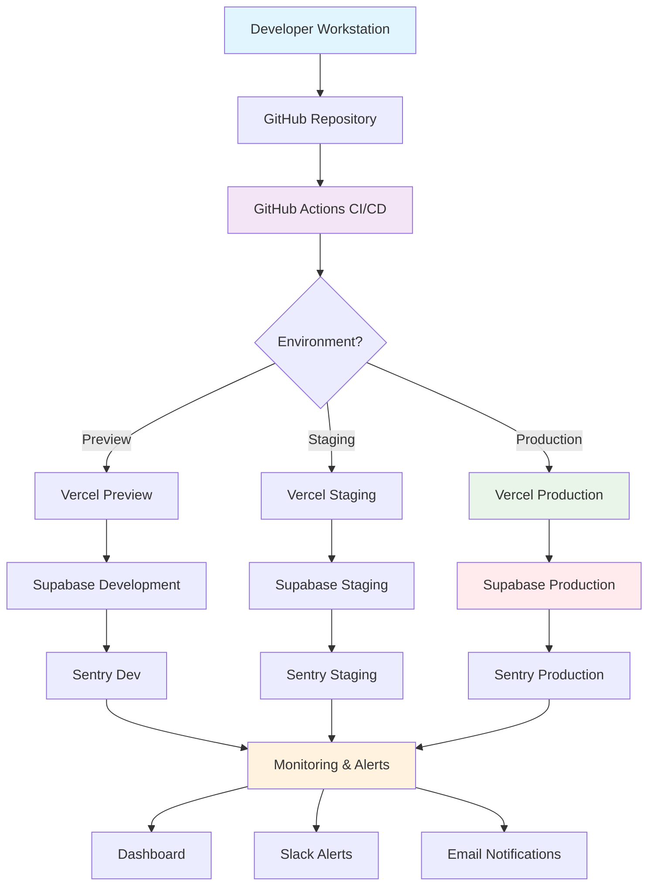

---

## **File 8: Deployment & DevOps (`deployment-devops.md`)**

### **1. DEPLOYMENT ARCHITECTURE OVERVIEW**



### **2. CI/CD PIPELINE CONFIGURATION**

#### **2.1 GitHub Actions Workflows**

```yaml
# .github/workflows/ci-cd.yml
name: CI/CD Pipeline

on:
  push:
    branches: [main, develop]
  pull_request:
    branches: [main]
  schedule:
    - cron: '0 0 * * *' # Daily at midnight

env:
  NODE_VERSION: '20.x'
  PNPM_VERSION: '8.x'
  SUPABASE_PROJECT_ID: ${{ secrets.SUPABASE_PROJECT_ID }}
  SENTRY_ORG: ${{ secrets.SENTRY_ORG }}
  SENTRY_PROJECT: ${{ secrets.SENTRY_PROJECT }}

jobs:
  # Job 1: Code Quality & Security
  code-quality:
    name: Code Quality & Security Scan
    runs-on: ubuntu-latest
    if: github.event_name == 'pull_request' || github.event_name == 'push'
    
    steps:
      - name: Checkout Repository
        uses: actions/checkout@v4
        
      - name: Setup Node.js
        uses: actions/setup-node@v4
        with:
          node-version: ${{ env.NODE_VERSION }}
          cache: 'pnpm'
          
      - name: Setup PNPM
        uses: pnpm/action-setup@v2
        with:
          version: ${{ env.PNPM_VERSION }}
          
      - name: Install Dependencies
        run: pnpm install --frozen-lockfile
        
      - name: Run TypeScript Type Check
        run: pnpm type-check
        
      - name: Run ESLint
        run: pnpm lint
        
      - name: Security Audit (npm audit)
        run: pnpm audit
        
      - name: Run SAST Scan (Semgrep)
        uses: returntocorp/semgrep-action@v1
        with:
          config: p/ci
          
      - name: Dependency Vulnerability Scan
        uses: actions/dependency-review-action@v3
        
      - name: Upload Security Report
        uses: actions/upload-artifact@v4
        if: always()
        with:
          name: security-report
          path: |
            semgrep.sarif
            npm-audit.json
          retention-days: 7

  # Job 2: Build & Test
  build-test:
    name: Build & Test
    runs-on: ubuntu-latest
    needs: [code-quality]
    if: github.event_name == 'pull_request' || github.event_name == 'push'
    
    strategy:
      matrix:
        node-version: [18.x, 20.x]
    
    steps:
      - name: Checkout Repository
        uses: actions/checkout@v4
        
      - name: Setup Node.js
        uses: actions/setup-node@v4
        with:
          node-version: ${{ matrix.node-version }}
          cache: 'pnpm'
          
      - name: Setup PNPM
        uses: pnpm/action-setup@v2
        with:
          version: ${{ env.PNPM_VERSION }}
          
      - name: Install Dependencies
        run: pnpm install --frozen-lockfile
        
      - name: Run Tests
        run: pnpm test:ci
        env:
          NEXT_PUBLIC_SUPABASE_URL: ${{ secrets.NEXT_PUBLIC_SUPABASE_URL }}
          NEXT_PUBLIC_SUPABASE_ANON_KEY: ${{ secrets.NEXT_PUBLIC_SUPABASE_ANON_KEY }}
          NEXT_PUBLIC_SENTRY_DSN: ${{ secrets.NEXT_PUBLIC_SENTRY_DSN }}
          
      - name: Run Integration Tests
        run: pnpm test:integration
        
      - name: Run Performance Tests
        run: pnpm test:performance
        
      - name: Upload Test Results
        uses: actions/upload-artifact@v4
        if: always()
        with:
          name: test-results-${{ matrix.node-version }}
          path: |
            test-results/
            coverage/
          retention-days: 7

  # Job 3: Performance Audit
  performance-audit:
    name: Performance Audit
    runs-on: ubuntu-latest
    needs: [build-test]
    if: github.event_name == 'push' && github.ref == 'refs/heads/main'
    
    steps:
      - name: Checkout Repository
        uses: actions/checkout@v4
        
      - name: Setup Node.js
        uses: actions/setup-node@v4
        with:
          node-version: ${{ env.NODE_VERSION }}
          cache: 'pnpm'
          
      - name: Setup PNPM
        uses: pnpm/action-setup@v2
        with:
          version: ${{ env.PNPM_VERSION }}
          
      - name: Install Dependencies
        run: pnpm install --frozen-lockfile
        
      - name: Build Application
        run: pnpm build
        env:
          NEXT_PUBLIC_SUPABASE_URL: ${{ secrets.NEXT_PUBLIC_SUPABASE_URL }}
          NEXT_PUBLIC_SUPABASE_ANON_KEY: ${{ secrets.NEXT_PUBLIC_SUPABASE_ANON_KEY }}
          
      - name: Run Lighthouse CI
        uses: treosh/lighthouse-ci-action@v10
        with:
          urls: |
            http://localhost:3000/
            http://localhost:3000/dashboard
            http://localhost:3000/agents
          uploadArtifacts: true
          temporaryPublicStorage: true
          
      - name: Run Bundle Analyzer
        run: |
          pnpm build --analyze
          cp .next/analyze/*.html bundle-report.html
          
      - name: Upload Performance Report
        uses: actions/upload-artifact@v4
        with:
          name: performance-report
          path: |
            .lighthouseci/
            bundle-report.html
          retention-days: 30

  # Job 4: Deploy to Staging
  deploy-staging:
    name: Deploy to Staging
    runs-on: ubuntu-latest
    needs: [performance-audit]
    if: github.event_name == 'push' && github.ref == 'refs/heads/develop'
    environment: staging
    
    steps:
      - name: Checkout Repository
        uses: actions/checkout@v4
        
      - name: Deploy to Vercel (Staging)
        uses: amondnet/vercel-action@v25
        with:
          vercel-token: ${{ secrets.VERCEL_TOKEN }}
          vercel-org-id: ${{ secrets.VERCEL_ORG_ID }}
          vercel-project-id: ${{ secrets.VERCEL_PROJECT_ID }}
          vercel-args: '--prod'
          working-directory: '.'
          vercel-account: ${{ secrets.VERCEL_ACCOUNT_ID }}
        env:
          VERCEL_ORG_ID: ${{ secrets.VERCEL_ORG_ID }}
          VERCEL_PROJECT_ID: ${{ secrets.VERCEL_PROJECT_ID }}
          
      - name: Run Database Migrations (Staging)
        run: |
          pnpm supabase link --project-ref ${{ secrets.SUPABASE_STAGING_PROJECT_REF }}
          pnpm supabase db push
        env:
          SUPABASE_ACCESS_TOKEN: ${{ secrets.SUPABASE_ACCESS_TOKEN }}
          
      - name: Run Seed Data (Staging)
        run: pnpm db:seed
        env:
          DATABASE_URL: ${{ secrets.SUPABASE_STAGING_DATABASE_URL }}
          
      - name: Run Smoke Tests (Staging)
        run: pnpm test:smoke --env=staging
        env:
          NEXT_PUBLIC_APP_URL: ${{ secrets.STAGING_URL }}
          
      - name: Notify Slack (Staging Deployed)
        uses: 8398a7/action-slack@v3
        if: success()
        with:
          status: ${{ job.status }}
          text: 'Staging deployment successful: ${{ github.sha }}'
        env:
          SLACK_WEBHOOK_URL: ${{ secrets.SLACK_WEBHOOK_URL }}

  # Job 5: Deploy to Production
  deploy-production:
    name: Deploy to Production
    runs-on: ubuntu-latest
    needs: [deploy-staging]
    if: github.event_name == 'push' && github.ref == 'refs/heads/main'
    environment: production
    
    steps:
      - name: Checkout Repository
        uses: actions/checkout@v4
        
      - name: Create Release Tag
        uses: actions/github-script@v6
        with:
          script: |
            const version = require('./package.json').version;
            github.rest.git.createRef({
              owner: context.repo.owner,
              repo: context.repo.repo,
              ref: `refs/tags/v${version}`,
              sha: context.sha
            });
            
      - name: Deploy to Vercel (Production)
        uses: amondnet/vercel-action@v25
        with:
          vercel-token: ${{ secrets.VERCEL_TOKEN }}
          vercel-org-id: ${{ secrets.VERCEL_ORG_ID }}
          vercel-project-id: ${{ secrets.VERCEL_PROJECT_ID }}
          vercel-args: '--prod --confirm'
          working-directory: '.'
        env:
          VERCEL_ORG_ID: ${{ secrets.VERCEL_ORG_ID }}
          VERCEL_PROJECT_ID: ${{ secrets.VERCEL_PROJECT_ID }}
          
      - name: Run Database Migrations (Production)
        run: |
          pnpm supabase link --project-ref ${{ secrets.SUPABASE_PROD_PROJECT_REF }}
          pnpm supabase db push
        env:
          SUPABASE_ACCESS_TOKEN: ${{ secrets.SUPABASE_ACCESS_TOKEN }}
          
      - name: Backup Database Before Migration
        run: pnpm db:backup --env=production
        env:
          DATABASE_URL: ${{ secrets.SUPABASE_PROD_DATABASE_URL }}
          
      - name: Run Smoke Tests (Production)
        run: pnpm test:smoke --env=production
        env:
          NEXT_PUBLIC_APP_URL: ${{ secrets.PRODUCTION_URL }}
          
      - name: Notify Slack (Production Deployed)
        uses: 8398a7/action-slack@v3
        if: success()
        with:
          status: ${{ job.status }}
          text: 'Production deployment successful: v${{ fromJSON(require('./package.json')).version }}'
        env:
          SLACK_WEBHOOK_URL: ${{ secrets.SLACK_WEBHOOK_URL }}
          
      - name: Create GitHub Release
        uses: softprops/action-gh-release@v1
        if: success()
        with:
          files: |
            bundle-report.html
            .lighthouseci/**/*.json
          tag_name: v${{ fromJSON(require('./package.json')).version }}
          generate_release_notes: true
```

#### **2.2 Vercel Configuration**

```json
{
  "vercel.json": {
    "version": 2,
    "builds": [
      {
        "src": "package.json",
        "use": "@vercel/next",
        "config": {
          "installCommand": "pnpm install",
          "buildCommand": "pnpm build",
          "outputDirectory": ".next"
        }
      }
    ],
    "routes": [
      {
        "src": "/api/(.*)",
        "dest": "/api/$1",
        "headers": {
          "Cache-Control": "public, max-age=0, must-revalidate",
          "X-Content-Type-Options": "nosniff",
          "X-Frame-Options": "DENY",
          "X-XSS-Protection": "1; mode=block"
        }
      },
      {
        "src": "/_next/static/(.*)",
        "dest": "/_next/static/$1",
        "headers": {
          "Cache-Control": "public, max-age=31536000, immutable"
        }
      },
      {
        "src": "/static/(.*)",
        "dest": "/static/$1",
        "headers": {
          "Cache-Control": "public, max-age=31536000, immutable"
        }
      },
      {
        "src": "/(.*)",
        "dest": "/$1",
        "headers": {
          "Cache-Control": "public, max-age=0, must-revalidate",
          "X-Content-Type-Options": "nosniff",
          "X-Frame-Options": "DENY",
          "X-XSS-Protection": "1; mode=block"
        }
      }
    ],
    "env": {
      "NEXT_PUBLIC_APP_ENV": "@app_env",
      "NEXT_PUBLIC_SUPABASE_URL": "@supabase_url",
      "NEXT_PUBLIC_SUPABASE_ANON_KEY": "@supabase_anon_key",
      "NEXT_PUBLIC_SENTRY_DSN": "@sentry_dsn",
      "NEXT_PUBLIC_GA_MEASUREMENT_ID": "@ga_measurement_id",
      "NEXT_PUBLIC_POSTHOG_KEY": "@posthog_key",
      "NEXT_PUBLIC_POSTHOG_HOST": "@posthog_host"
    },
    "regions": ["iad1"],
    "functions": {
      "api/**/*.ts": {
        "maxDuration": 10,
        "memory": 1024
      }
    },
    "experimental": {
      "prerender": {
        "crawl": true,
        "enabled": true,
        "globs": [
          "/",
          "/dashboard",
          "/agents/**",
          "/docs/**"
        ]
      }
    }
  }
}
```

### **3. ENVIRONMENT CONFIGURATION**

#### **3.1 Environment Variables Management**

```typescript
// lib/env.ts
import { z } from 'zod';

// Environment schema validation
const envSchema = z.object({
  // Node Environment
  NODE_ENV: z.enum(['development', 'test', 'production']).default('development'),
  
  // Supabase
  NEXT_PUBLIC_SUPABASE_URL: z.string().url(),
  NEXT_PUBLIC_SUPABASE_ANON_KEY: z.string().min(1),
  SUPABASE_SERVICE_ROLE_KEY: z.string().min(1),
  SUPABASE_JWT_SECRET: z.string().min(1),
  
  // Database
  DATABASE_URL: z.string().url(),
  DIRECT_DATABASE_URL: z.string().url().optional(),
  
  // Authentication
  NEXTAUTH_URL: z.string().url(),
  NEXTAUTH_SECRET: z.string().min(32),
  
  // Monitoring & Analytics
  NEXT_PUBLIC_SENTRY_DSN: z.string().url().optional(),
  SENTRY_AUTH_TOKEN: z.string().optional(),
  NEXT_PUBLIC_POSTHOG_KEY: z.string().optional(),
  NEXT_PUBLIC_POSTHOG_HOST: z.string().url().optional(),
  NEXT_PUBLIC_GA_MEASUREMENT_ID: z.string().optional(),
  
  // External APIs
  OPENAI_API_KEY: z.string().optional(),
  ANTHROPIC_API_KEY: z.string().optional(),
  COINGECKO_API_KEY: z.string().optional(),
  PINATA_JWT: z.string().optional(),
  PINATA_GATEWAY_URL: z.string().url().optional(),
  
  // Feature Flags
  NEXT_PUBLIC_ENABLE_EXPERIMENTAL_FEATURES: z
    .string()
    .transform((val) => val === 'true')
    .default('false'),
  NEXT_PUBLIC_ENABLE_ANALYTICS: z
    .string()
    .transform((val) => val === 'true')
    .default('true'),
    
  // Performance
  NEXT_PUBLIC_ENABLE_PERFORMANCE_MONITORING: z
    .string()
    .transform((val) => val === 'true')
    .default('true'),
  NEXT_PUBLIC_PERFORMANCE_SAMPLE_RATE: z
    .string()
    .transform((val) => parseFloat(val))
    .default('0.1'),
    
  // Security
  NEXT_PUBLIC_CSP_ENABLED: z
    .string()
    .transform((val) => val === 'true')
    .default('true'),
  NEXT_PUBLIC_HSTS_ENABLED: z
    .string()
    .transform((val) => val === 'true')
    .default('true'),
});

// Parse environment variables
const parsedEnv = envSchema.safeParse({
  NODE_ENV: process.env.NODE_ENV,
  NEXT_PUBLIC_SUPABASE_URL: process.env.NEXT_PUBLIC_SUPABASE_URL,
  NEXT_PUBLIC_SUPABASE_ANON_KEY: process.env.NEXT_PUBLIC_SUPABASE_ANON_KEY,
  SUPABASE_SERVICE_ROLE_KEY: process.env.SUPABASE_SERVICE_ROLE_KEY,
  SUPABASE_JWT_SECRET: process.env.SUPABASE_JWT_SECRET,
  DATABASE_URL: process.env.DATABASE_URL,
  DIRECT_DATABASE_URL: process.env.DIRECT_DATABASE_URL,
  NEXTAUTH_URL: process.env.NEXTAUTH_URL,
  NEXTAUTH_SECRET: process.env.NEXTAUTH_SECRET,
  NEXT_PUBLIC_SENTRY_DSN: process.env.NEXT_PUBLIC_SENTRY_DSN,
  SENTRY_AUTH_TOKEN: process.env.SENTRY_AUTH_TOKEN,
  NEXT_PUBLIC_POSTHOG_KEY: process.env.NEXT_PUBLIC_POSTHOG_KEY,
  NEXT_PUBLIC_POSTHOG_HOST: process.env.NEXT_PUBLIC_POSTHOG_HOST,
  NEXT_PUBLIC_GA_MEASUREMENT_ID: process.env.NEXT_PUBLIC_GA_MEASUREMENT_ID,
  OPENAI_API_KEY: process.env.OPENAI_API_KEY,
  ANTHROPIC_API_KEY: process.env.ANTHROPIC_API_KEY,
  COINGECKO_API_KEY: process.env.COINGECKO_API_KEY,
  PINATA_JWT: process.env.PINATA_JWT,
  PINATA_GATEWAY_URL: process.env.PINATA_GATEWAY_URL,
  NEXT_PUBLIC_ENABLE_EXPERIMENTAL_FEATURES: process.env.NEXT_PUBLIC_ENABLE_EXPERIMENTAL_FEATURES,
  NEXT_PUBLIC_ENABLE_ANALYTICS: process.env.NEXT_PUBLIC_ENABLE_ANALYTICS,
  NEXT_PUBLIC_ENABLE_PERFORMANCE_MONITORING: process.env.NEXT_PUBLIC_ENABLE_PERFORMANCE_MONITORING,
  NEXT_PUBLIC_PERFORMANCE_SAMPLE_RATE: process.env.NEXT_PUBLIC_PERFORMANCE_SAMPLE_RATE,
  NEXT_PUBLIC_CSP_ENABLED: process.env.NEXT_PUBLIC_CSP_ENABLED,
  NEXT_PUBLIC_HSTS_ENABLED: process.env.NEXT_PUBLIC_HSTS_ENABLED,
});

if (!parsedEnv.success) {
  console.error('❌ Invalid environment variables:', parsedEnv.error.format());
  throw new Error('Invalid environment variables');
}

export const env = parsedEnv.data;
export type Env = z.infer<typeof envSchema>;

// Environment-specific configurations
export const environmentConfig = {
  development: {
    supabaseUrl: env.NEXT_PUBLIC_SUPABASE_URL,
    supabaseKey: env.NEXT_PUBLIC_SUPABASE_ANON_KEY,
    enableAnalytics: false,
    logLevel: 'debug',
    cacheTtl: 60, // 1 minute
    apiTimeout: 30000, // 30 seconds
  },
  test: {
    supabaseUrl: env.NEXT_PUBLIC_SUPABASE_URL,
    supabaseKey: env.NEXT_PUBLIC_SUPABASE_ANON_KEY,
    enableAnalytics: false,
    logLevel: 'error',
    cacheTtl: 0, // No caching in tests
    apiTimeout: 10000, // 10 seconds
  },
  production: {
    supabaseUrl: env.NEXT_PUBLIC_SUPABASE_URL,
    supabaseKey: env.NEXT_PUBLIC_SUPABASE_ANON_KEY,
    enableAnalytics: env.NEXT_PUBLIC_ENABLE_ANALYTICS,
    logLevel: 'warn',
    cacheTtl: 300, // 5 minutes
    apiTimeout: 10000, // 10 seconds
  },
}[env.NODE_ENV];

// Feature flags
export const featureFlags = {
  experimentalFeatures: env.NEXT_PUBLIC_ENABLE_EXPERIMENTAL_FEATURES,
  performanceMonitoring: env.NEXT_PUBLIC_ENABLE_PERFORMANCE_MONITORING,
  analytics: env.NEXT_PUBLIC_ENABLE_ANALYTICS,
  csp: env.NEXT_PUBLIC_CSP_ENABLED,
  hsts: env.NEXT_PUBLIC_HSTS_ENABLED,
};

// Security headers configuration
export const securityHeaders = {
  'X-Content-Type-Options': 'nosniff',
  'X-Frame-Options': 'DENY',
  'X-XSS-Protection': '1; mode=block',
  'Referrer-Policy': 'strict-origin-when-cross-origin',
  'Permissions-Policy': 'camera=(), microphone=(), geolocation=()',
  ...(env.NODE_ENV === 'production' && env.NEXT_PUBLIC_HSTS_ENABLED
    ? { 'Strict-Transport-Security': 'max-age=31536000; includeSubDomains' }
    : {}),
};
```

#### **3.2 Environment Setup Scripts**

```bash
#!/bin/bash
# scripts/setup-environment.sh

set -e

echo "🚀 Setting up environment..."

# Check if .env file exists
if [ ! -f .env ]; then
  echo "📝 Creating .env file from template..."
  cp .env.example .env
fi

# Load environment variables
set -a
source .env
set +a

# Function to prompt for missing variables
prompt_for_variable() {
  local var_name=$1
  local default_value=$2
  local prompt_message=$3
  
  if [ -z "${!var_name}" ]; then
    read -p "$prompt_message [$default_value]: " value
    value=${value:-$default_value}
    echo "export $var_name=\"$value\"" >> .env
    export "$var_name=$value"
  fi
}

# Required variables
echo "🔐 Setting up required environment variables..."

prompt_for_variable "NEXT_PUBLIC_SUPABASE_URL" "" "Enter Supabase project URL:"
prompt_for_variable "NEXT_PUBLIC_SUPABASE_ANON_KEY" "" "Enter Supabase anonymous key:"
prompt_for_variable "SUPABASE_SERVICE_ROLE_KEY" "" "Enter Supabase service role key:"
prompt_for_variable "DATABASE_URL" "" "Enter database connection URL:"
prompt_for_variable "NEXTAUTH_SECRET" "$(openssl rand -base64 32)" "Enter NextAuth secret:"

# Optional variables with defaults
prompt_for_variable "NODE_ENV" "development" "Enter Node environment:"
prompt_for_variable "NEXT_PUBLIC_APP_URL" "http://localhost:3000" "Enter app URL:"
prompt_for_variable "NEXTAUTH_URL" "http://localhost:3000" "Enter NextAuth URL:"
prompt_for_variable "NEXT_PUBLIC_ENABLE_ANALYTICS" "false" "Enable analytics? (true/false):"

# Setup Supabase
echo "🛠️ Setting up Supabase..."
if command -v supabase &> /dev/null; then
  read -p "Do you want to link to Supabase project? (y/n): " link_supabase
  if [[ $link_supabase == "y" ]]; then
    supabase login
    supabase link --project-ref "$SUPABASE_PROJECT_ID"
 supabase db pull
  fi
else
  echo "⚠️ Supabase CLI not installed. Install with: npm install -g supabase"
fi

# Install dependencies
echo "📦 Installing dependencies..."
pnpm install

# Setup database
echo "🗄️ Setting up database..."
read -p "Run database migrations? (y/n): " run_migrations
if [[ $run_migrations == "y" ]]; then
  pnpm db:migrate
fi

read -p "Seed database with initial data? (y/n): " seed_database
if [[ $seed_database == "y" ]]; then
  pnpm db:seed
fi

# Build project
echo "🔨 Building project..."
pnpm build

echo "✅ Environment setup complete!"
echo ""
echo "📋 Next steps:"
echo "1. Start development server: pnpm dev"
echo "2. Access app at: ${NEXT_PUBLIC_APP_URL:-http://localhost:3000}"
echo "3. Check .env file for configured variables"

4. DATABASE MIGRATION STRATEGY
4.1 Migration Scripts
typescript // scripts/migrations/run-migrations.ts
import { createClient } from '@supabase/supabase-js';
import fs from 'fs';
import path from 'path';
import { fileURLToPath } from 'url';

const __dirname = path.dirname(fileURLToPath(import.meta.url));

interface Migration {
  id: string;
  name: string;
  filename: string;
  applied_at?: Date;
}

class MigrationRunner {
  private supabase: ReturnType<typeof createClient>;
  private migrationsPath: string;
  
  constructor() {
    this.supabase = createClient(
      process.env.NEXT_PUBLIC_SUPABASE_URL!,
      process.env.SUPABASE_SERVICE_ROLE_KEY!
    );
    this.migrationsPath = path.join(__dirname, 'migrations');
  }
  
  async runMigrations(targetVersion?: string): Promise<void> {
    console.log('🚀 Starting database migrations...');
    
    try {
      // Ensure migrations table exists
      await this.ensureMigrationsTable();
      
      // Get all migration files
      const migrationFiles = await this.getMigrationFiles();
      
      // Get applied migrations
      const appliedMigrations = await this.getAppliedMigrations();
      
      // Determine which migrations to run
      const migrationsToRun = migrationFiles.filter(migration => {
        const isApplied = appliedMigrations.some(applied => applied.id === migration.id);
        
        if (targetVersion) {
          return !isApplied && migration.id <= targetVersion;
        }
        
        return !isApplied;
      });
      
      if (migrationsToRun.length === 0) {
        console.log('✅ No new migrations to apply');
        return;
      }
      
      console.log(`📦 Found ${migrationsToRun.length} migrations to apply`);
      
      // Run migrations in transaction
      for (const migration of migrationsToRun) {
        await this.runMigration(migration);
      }
      
      console.log('✅ All migrations applied successfully');
      
    } catch (error) {
      console.error('❌ Migration failed:', error);
      throw error;
    }
  }
  
  private async ensureMigrationsTable(): Promise<void> {
    const { error } = await this.supabase.rpc('ensure_migrations_table');
    
    if (error && error.code !== '42P07') { // Table already exists
      throw error;
    }
  }
  
  private async getMigrationFiles(): Promise<Migration[]> {
    const files = fs.readdirSync(this.migrationsPath)
      .filter(file => file.endsWith('.sql'))
      .sort();
    
    return files.map(filename => {
      const match = filename.match(/^(\d+)_(.+)\.sql$/);
      if (!match) {
        throw new Error(`Invalid migration filename: ${filename}`);
      }
      
      return {
        id: match[1],
        name: match[2].replace(/_/g, ' '),
        filename,
      };
    });
  }
  
  private async getAppliedMigrations(): Promise<Migration[]> {
    const { data, error } = await this.supabase
      .from('migrations')
      .select('*')
      .order('id', { ascending: true });
    
    if (error) throw error;
    
    return (data || []).map(row => ({
      id: row.id,
      name: row.name,
      filename: row.filename,
      applied_at: new Date(row.applied_at),
    }));
  }
  
  private async runMigration(migration: Migration): Promise<void> {
    console.log(`📝 Applying migration: ${migration.name} (${migration.id})`);
    
    const filePath = path.join(this.migrationsPath, migration.filename);
    const sql = fs.readFileSync(filePath, 'utf-8');
    
    // Split SQL by statements
    const statements = sql
      .split(';')
      .map(stmt => stmt.trim())
      .filter(stmt => stmt.length > 0);
    
    // Run each statement
    for (const [index, statement] of statements.entries()) {
      console.log(`  Running statement ${index + 1}/${statements.length}`);
      
      const { error } = await this.supabase.rpc('execute_sql', {
        sql: statement,
      });
      
      if (error) {
        throw new Error(`Migration ${migration.id} failed at statement ${index + 1}: ${error.message}`);
      }
    }
    
    // Record migration
    const { error } = await this.supabase
      .from('migrations')
      .insert({
        id: migration.id,
        name: migration.name,
        filename: migration.filename,
        applied_at: new Date().toISOString(),
      });
    
    if (error) throw error;
    
    console.log(`✅ Applied migration: ${migration.name}`);
  }
  
  async rollbackMigration(migrationId: string): Promise<void> {
    console.log(`⏪ Rolling back migration: ${migrationId}`);
    
    const rollbackFile = path.join(this.migrationsPath, `${migrationId}_rollback.sql`);
    
    if (!fs.existsSync(rollbackFile)) {
      throw new Error(`Rollback file not found: ${rollbackFile}`);
    }
    
    const sql = fs.readFileSync(rollbackFile, 'utf-8');
    const statements = sql
      .split(';')
      .map(stmt => stmt.trim())
      .filter(stmt => stmt.length > 0);
    
    for (const statement of statements) {
      const { error } = await this.supabase.rpc('execute_sql', {
        sql: statement,
      });
      
      if (error) throw error;
    }
    
    // Remove migration record
    const { error } = await this.supabase
      .from('migrations')
      .delete()
      .eq('id', migrationId);
    
    if (error) throw error;
    
    console.log(`✅ Rolled back migration: ${migrationId}`);
  }
  
  async createMigration(name: string): Promise<string> {
    const timestamp = Date.now();
    const migrationId = timestamp.toString();
    const filename = `${migrationId}_${name.replace(/\s+/g, '_')}.sql`;
    const rollbackFilename = `${migrationId}_rollback.sql`;
    
    const migrationPath = path.join(this.migrationsPath, filename);
    const rollbackPath = path.join(this.migrationsPath, rollbackFilename);
    
    // Create migration template
    const migrationTemplate = `-- Migration: ${name}
-- ID: ${migrationId}
-- Created: ${new Date().toISOString()}

BEGIN;

-- Your migration SQL here

COMMIT;`;
    
    // Create rollback template
    const rollbackTemplate = `-- Rollback: ${name}
-- ID: ${migrationId}
-- Created: ${new Date().toISOString()}

BEGIN;

-- Your rollback SQL here

COMMIT;`;
    
    fs.writeFileSync(migrationPath, migrationTemplate);
    fs.writeFileSync(rollbackPath, rollbackTemplate);
    
    console.log(`📝 Created migration: ${filename}`);
    console.log(`📝 Created rollback: ${rollbackFilename}`);
    
    return migrationId;
  }
}

// CLI interface
if (process.argv[2] === 'run') {
  const targetVersion = process.argv[3];
  const runner = new MigrationRunner();
  runner.runMigrations(targetVersion)
    .then(() => process.exit(0))
    .catch(error => {
      console.error(error);
      process.exit(1);
    });
} else if (process.argv[2] === 'rollback') {
  const migrationId = process.argv[3];
  if (!migrationId) {
    console.error('Usage: pnpm migration:rollback <migration-id>');
    process.exit(1);
  }
  
  const runner = new MigrationRunner();
  runner.rollbackMigration(migrationId)
    .then(() => process.exit(0))
    .catch(error => {
      console.error(error);
      process.exit(1);
    });
} else if (process.argv[2] === 'create') {
  const name = process.argv.slice(3).join(' ');
  if (!name) {
    console.error('Usage: pnpm migration:create <migration-name>');
    process.exit(1);
  }
  
  const runner = new MigrationRunner();
  runner.createMigration(name)
    .then(id => {
      console.log(`✅ Created migration with ID: ${id}`);
      process.exit(0);
    })
    .catch(error => {
      console.error(error);
      process.exit(1);
    });
}

4.2 Database Backup Script
typescript
// scripts/database/backup.ts
import { createClient } from '@supabase/supabase-js';
import { exec } from 'child_process';
import fs from 'fs';
import path from 'path';
import { promisify } from 'util';
import { S3Client, PutObjectCommand } from '@aws-sdk/client-s3';

const execAsync = promisify(exec);

interface BackupConfig {
  supabaseUrl: string;
  supabaseKey: string;
  databaseUrl: string;
  backupDir: string;
  retentionDays: number;
  s3Bucket?: string;
  s3Region?: string;
  s3AccessKeyId?: string;
  s3SecretAccessKey?: string;
}

class DatabaseBackup {
  private config: BackupConfig;
  private supabase: ReturnType<typeof createClient>;
  private s3Client?: S3Client;
  
  constructor(config: BackupConfig) {
    this.config = config;
    this.supabase = createClient(config.supabaseUrl, config.supabaseKey);
    
    if (config.s3Bucket && config.s3AccessKeyId && config.s3SecretAccessKey) {
      this.s3Client = new S3Client({
        region: config.s3Region || 'us-east-1',
        credentials: {
          accessKeyId: config.s3AccessKeyId,
          secretAccessKey: config.s3SecretAccessKey,
        },
      });
    }
  }
  
  async createBackup(): Promise<string> {
    console.log('💾 Starting database backup...');
    
    const timestamp = new Date().toISOString().replace(/[:.]/g, '-');
    const backupFilename = `backup-${timestamp}.sql`;
    const backupPath = path.join(this.config.backupDir, backupFilename);
    
    try {
      // 1. Create local backup using pg_dump
      console.log('📦 Creating local backup...');
      await this.createLocalBackup(backupPath);
      
      // 2. Compress backup
      console.log('🗜️ Compressing backup...');
      const compressedPath = await this.compressBackup(backupPath);
      
      // 3. Upload to S3 if configured
      if (this.s3Client && this.config.s3Bucket) {
        console.log('☁️ Uploading to S3...');
        await this.uploadToS3(compressedPath);
      }
      
      // 4. Clean up old backups
      console.log '🧹 Cleaning up old backups...');
      await this.cleanupOldBackups();
      
      // 5. Record backup in database
      await this.recordBackup(backupFilename);
      
      console.log(`✅ Backup completed: ${backupFilename}`);
      return backupFilename;
      
    } catch (error) {
      console.error('❌ Backup failed:', error);
      throw error;
    }
  }
  
  private async createLocalBackup(outputPath: string): Promise<void> {
    const { databaseUrl } = this.config;
    
    // Extract connection details from URL
    const url = new URL(databaseUrl);
    const database = url.pathname.slice(1);
    const host = url.hostname;
    const port = url.port || '5432';
    const username = url.username;
    const password = url.password;
    
    // Set password environment variable for pg_dump
    process.env.PGPASSWORD = password;
    
    const command = [
      'pg_dump',
      `--host=${host}`,
      `--port=${port}`,
      `--username=${username}`,
      `--dbname=${database}`,
      '--format=custom', // Binary format (smaller, faster)
      '--compress=9',
      '--no-owner',
      '--no-acl',
      '--verbose',
      `--file=${outputPath}`,
    ].join(' ');
    
    const { stderr } = await execAsync(command);
    
    if (stderr && !stderr.includes('WARNING')) {
      throw new Error(`pg_dump failed: ${stderr}`);
    }
    
    // Verify backup file was created
    if (!fs.existsSync(outputPath)) {
      throw new Error('Backup file was not created');
    }
    
    const stats = fs.statSync(outputPath);
    console.log(`📊 Backup size: \${(stats.size / 1024 / 1024).toFixed(2)} MB`);
  }
  
  private async compressBackup(backupPath: string): Promise<string> {
    const compressedPath = `\${backupPath}.gz`;
    
    const command = `gzip -9 -c "${backupPath}" > "${compressedPath}"`;
    await execAsync(command);
    
    // Remove uncompressed backup
    fs.unlinkSync(backupPath);
    
    const stats = fs.statSync(compressedPath);
    console.log(`📊 Compressed size: \${(stats.size / 1024 / 1024).toFixed(2)} MB`);
    
    return compressedPath;
  }
  
  private async uploadToS3(filePath: string): Promise<void> {
    if (!this.s3Client || !this.config.s3Bucket) {
      throw new Error('S3 configuration missing');
    }
    
    const fileContent = fs.readFileSync(filePath);
    const filename = path.basename(filePath);
    
    const command = new PutObjectCommand({
      Bucket: this.config.s3Bucket,
      Key: `database-backups/\${filename}`,
      Body: fileContent,
      ContentType: 'application/gzip',
      Metadata: {
        'backup-timestamp': new Date().toISOString(),
        'database': 'main',
      },
    });
    
    await this.s3Client.send(command);
    console.log(`✅ Uploaded to S3: s3://${this.config.s3Bucket}/database-backups/${filename}`);
  }
  
 private async cleanupOldBackups(): Promise<void> {
    const files = fs.readdirSync(this.config.backupDir)
      .filter(file => file.startsWith('backup-') && file.endsWith('.sql.gz'))
      .map(file => ({
        name: file,
        path: path.join(this.config.backupDir, file),
        time: fs.statSync(path.join(this.config.backupDir, file)).mtime.getTime(),
      }))
      .sort((a, b) => b.time - a.time); // Sort by newest first

    const cutoffTime = Date.now() - (this.config.retentionDays * 24 * 60 * 60 * 1000);
    
    for (const file of files) {
      if (file.time < cutoffTime) {
        console.log(`🗑️  Deleting old backup: ${file.name}`);
        fs.unlinkSync(file.path);
      }
    }
    
    console.log(`🧹 Cleaned up ${files.filter(f => f.time < cutoffTime).length} old backups`);
  }
  
  private async recordBackup(backupFilename: string): Promise<void> {
    const { error } = await this.supabase
      .from('backup_history')
      .insert({
        filename: backupFilename,
        size_bytes: fs.statSync(path.join(this.config.backupDir, `${backupFilename}.gz`)).size,
        backup_type: 'full',
        status: 'completed',
        recorded_at: new Date().toISOString(),
      });
    
    if (error) {
      console.warn('⚠️ Failed to record backup in database:', error.message);
    }
  }
  
  async listBackups(): Promise<Array<{
    filename: string;
    size: string;
    date: Date;
    location: 'local' | 's3' | 'both';
  }>> {
    const localFiles = fs.readdirSync(this.config.backupDir)
      .filter(file => file.startsWith('backup-') && file.endsWith('.sql.gz'))
      .map(file => {
        const stats = fs.statSync(path.join(this.config.backupDir, file));
        return {
          filename: file,
          size: `${(stats.size / 1024 / 1024).toFixed(2)} MB`,
          date: stats.mtime,
          location: 'local' as const,
        };
      });
    
    // If S3 is configured, also list S3 backups
    let s3Backups: Array<any> = [];
    if (this.s3Client && this.config.s3Bucket) {
      // This would require S3 list operation
      // For brevity, we'll skip the actual S3 listing implementation
      console.log('📁 S3 backup listing requires additional S3 client setup');
    }
    
    return [...localFiles, ...s3Backups].sort((a, b) => 
      b.date.getTime() - a.date.getTime()
    );
  }
  
  async restoreBackup(backupFilename: string): Promise<void> {
    console.log(`🔄 Restoring backup: ${backupFilename}`);
    
    const backupPath = path.join(this.config.backupDir, backupFilename);
    
    if (!fs.existsSync(backupPath)) {
      throw new Error(`Backup file not found: ${backupPath}`);
    }
    
    const { databaseUrl } = this.config;
    const url = new URL(databaseUrl);
    const database = url.pathname.slice(1);
    const host = url.hostname;
    const port = url.port || '5432';
    const username = url.username;
    const password = url.password;
    
    // Set password environment variable for pg_restore
    process.env.PGPASSWORD = password;
    
    // Drop existing connections first
    const dropConnectionsCommand = [
      'psql',
      `--host=${host}`,
      `--port=${port}`,
      `--username=${username}`,
      `--dbname=${database}`,
      '--command="SELECT pg_terminate_backend(pid) FROM pg_stat_activity WHERE datname = current_database() AND pid <> pg_backend_pid();"',
    ].join(' ');
    
    try {
      await execAsync(dropConnectionsCommand);
    } catch (error) {
      console.warn('⚠️ Could not drop existing connections:', error.message);
    }
    
    // Restore the backup
    const command = [
      'pg_restore',
      `--host=${host}`,
      `--port=${port}`,
      `--username=${username}`,
      `--dbname=${database}`,
      '--clean', // Clean (drop) database objects before recreating
      '--if-exists',
      '--verbose',
      `"${backupPath}"`,
    ].join(' ');
    
    const { stdout, stderr } = await execAsync(command);
    
    if (stderr && !stderr.includes('WARNING')) {
      throw new Error(`pg_restore failed: ${stderr}`);
    }
    
    console.log(`✅ Backup restored: ${backupFilename}`);
    
    // Record restoration
    const { error } = await this.supabase
      .from('backup_history')
      .update({
        restored_at: new Date().toISOString(),
        restored_by: 'system',
      })
      .eq('filename', backupFilename.replace('.gz', ''));
    
    if (error) {
      console.warn('⚠️ Failed to record restoration:', error.message);
    }
  }
}

// Export for use in scripts
export const backupManager = new DatabaseBackup({
  supabaseUrl: process.env.NEXT_PUBLIC_SUPABASE_URL!,
  supabaseKey: process.env.SUPABASE_SERVICE_ROLE_KEY!,
  databaseUrl: process.env.DATABASE_URL!,
  backupDir: path.join(process.cwd(), 'backups'),
  retentionDays: parseInt(process.env.BACKUP_RETENTION_DAYS || '30'),
  s3Bucket: process.env.AWS_S3_BACKUP_BUCKET,
  s3Region: process.env.AWS_S3_REGION,
  s3AccessKeyId: process.env.AWS_ACCESS_KEY_ID,
  s3SecretAccessKey: process.env.AWS_SECRET_ACCESS_KEY,
});

4.3 Database Schema Versioning
sql
-- scripts/migrations/001_initial_schema.sql
-- Migration: Initial Schema
-- ID: 001
-- Created: 2024-01-01

BEGIN;

-- Enable UUID extension
CREATE EXTENSION IF NOT EXISTS "uuid-ossp";

-- Enable Row Level Security
ALTER DATABASE CURRENT SET row_security = on;

-- Create migrations table to track applied migrations
CREATE TABLE IF NOT EXISTS migrations (
  id VARCHAR(20) PRIMARY KEY,
  name VARCHAR(255) NOT NULL,
  filename VARCHAR(255) NOT NULL,
  applied_at TIMESTAMP WITH TIME ZONE NOT NULL DEFAULT NOW(),
  checksum VARCHAR(64),
  executed_by VARCHAR(255) DEFAULT CURRENT_USER
);

-- Create backup history table
CREATE TABLE IF NOT EXISTS backup_history (
  id UUID DEFAULT uuid_generate_v4() PRIMARY KEY,
  filename VARCHAR(255) NOT NULL,
  size_bytes BIGINT NOT NULL,
  backup_type VARCHAR(50) NOT NULL,
  status VARCHAR(50) NOT NULL,
  recorded_at TIMESTAMP WITH TIME ZONE NOT NULL DEFAULT NOW(),
  restored_at TIMESTAMP WITH TIME ZONE,
  restored_by VARCHAR(255),
  notes TEXT
);

-- Create function to execute SQL safely
CREATE OR REPLACE FUNCTION execute_sql(sql TEXT)
RETURNS VOID AS $$
BEGIN
  EXECUTE sql;
END;
$$ LANGUAGE plpgsql SECURITY DEFINER;

-- Create function to ensure migrations table exists
CREATE OR REPLACE FUNCTION ensure_migrations_table()
RETURNS VOID AS $$
BEGIN
  CREATE TABLE IF NOT EXISTS migrations (
    id VARCHAR(20) PRIMARY KEY,
    name VARCHAR(255) NOT NULL,
    filename VARCHAR(255) NOT NULL,
    applied_at TIMESTAMP WITH TIME ZONE NOT NULL DEFAULT NOW(),
    checksum VARCHAR(64),
    executed_by VARCHAR(255) DEFAULT CURRENT_USER
  );
END;
$$ LANGUAGE plpgsql;

COMMIT;

5. MONITORING & OBSERVABILITY SETUP
5.1 Sentry Configuration
typescript
// lib/sentry.ts
import * as Sentry from '@sentry/nextjs';

const SENTRY_DSN = process.env.NEXT_PUBLIC_SENTRY_DSN;
const SENTRY_ENVIRONMENT = process.env.NEXT_PUBLIC_APP_ENV || 'development';
const SENTRY_RELEASE = process.env.NEXT_PUBLIC_SENTRY_RELEASE || '1.0.0';
const SENTRY_SAMPLE_RATE = parseFloat(process.env.NEXT_PUBLIC_SENTRY_SAMPLE_RATE || '0.1');

export function initializeSentry(): void {
  if (!SENTRY_DSN) {
    console.warn('Sentry DSN not configured, skipping Sentry initialization');
    return;
  }

  Sentry.init({
    dsn: SENTRY_DSN,
    environment: SENTRY_ENVIRONMENT,
    release: SENTRY_RELEASE,
    
    // Performance Monitoring
    tracesSampleRate: SENTRY_SAMPLE_RATE,
    profilesSampleRate: SENTRY_SAMPLE_RATE,
    
    // Session Replay
    replaysSessionSampleRate: 0.1,
    replaysOnErrorSampleRate: 1.0,
    
    // Ignore certain errors
    ignoreErrors: [
      'ResizeObserver loop limit exceeded',
      'Navigation cancelled',
      'ChunkLoadError',
      'Loading chunk',
    ],
    
    // Filter sensitive data
    beforeSend(event) {
      // Remove sensitive data
      if (event.request?.cookies) {
        delete event.request.cookies;
      }
      
      if (event.request?.headers) {
        // Filter authorization headers
        if (event.request.headers.authorization) {
          event.request.headers.authorization = '[REDACTED]';
        }
      }
      
      // Filter user context
      if (event.user) {
        event.user = {
          id: event.user.id,
          ip_address: '{{auto}}',
        };
      }
      
      return event;
    },
    
    // Integrations
    integrations: [
      Sentry.replayIntegration({
        maskAllText: true,
        blockAllMedia: true,
      }),
      Sentry.browserTracingIntegration(),
      Sentry.browserProfilingIntegration(),
    ],
    
    // Debug mode in development
    debug: SENTRY_ENVIRONMENT === 'development',
    
    // Transport options
    transportOptions: {
      fetchParameters: {
        keepalive: true,
      },
    },
  });
}

export function captureError(error: Error, context?: Record<string, any>): void {
  Sentry.captureException(error, {
    tags: {
      component: 'frontend',
    },
    extra: context,
  });
}

export function captureMessage(message: string, level: Sentry.SeverityLevel = 'info'): void {
  Sentry.captureMessage(message, {
    level,
    tags: {
      component: 'frontend',
    },
  });
}

export function setUserContext(user: {
  id: string;
  email?: string;
  username?: string;
}): void {
  Sentry.setUser({
    id: user.id,
    email: user.email,
    username: user.username,
  });
}

export function clearUserContext(): void {
  Sentry.setUser(null);
}

export function startTransaction(name: string, op?: string): Sentry.Transaction {
  return Sentry.startTransaction({
    name,
    op: op || 'default',
  });
}

export function withSentry<T extends (...args: any[]) => any>(
  handler: T,
  options?: {
    operation?: string;
    onError?: (error: Error) => void;
  }
): (...args: Parameters<T>) => Promise<ReturnType<T>> {
  return async (...args: Parameters<T>): Promise<ReturnType<T>> => {
    const transaction = startTransaction(
      handler.name || 'anonymous-function',
      options?.operation
    );
    
    const span = transaction.startChild({
      op: 'function',
      description: handler.name || 'anonymous',
    });
    
    try {
      const result = await handler(...args);
      span.finish();
      transaction.finish();
      return result;
    } catch (error) {
      span.setStatus('error');
      span.finish();
      transaction.setStatus('error');
      transaction.finish();
      
      captureError(error as Error, {
        function: handler.name,
        args: args.map(arg => 
          typeof arg === 'object' ? '[Object]' : String(arg)
        ),
      });
      
      if (options?.onError) {
        options.onError(error as Error);
      }
      
      throw error;
    }
  };
}

// Next.js specific integrations
export const withSentryAPI = Sentry.withSentryAPI;
export const withSentryServerSideGetInitialProps = Sentry.withSentryServerSideGetInitialProps;
export const withSentryServerSideAppGetInitialProps = Sentry.withSentryServerSideAppGetInitialProps;
export const withSentryServerSideDocumentGetInitialProps = Sentry.withSentryServerSideDocumentGetInitialProps;
export const withSentryServerSideErrorGetInitialProps = Sentry.withSentryServerSideErrorGetInitialProps;

5.2 Logging Configuration
typescript
// lib/logger.ts
import winston from 'winston';
import { SentryTransport } from 'winston-transport-sentry-node';
import DailyRotateFile from 'winston-daily-rotate-file';

export type LogLevel = 'error' | 'warn' | 'info' | 'http' | 'verbose' | 'debug' | 'silly';

export interface LogEntry {
  timestamp: string;
  level: LogLevel;
  message: string;
  component?: string;
  userId?: string;
  requestId?: string;
  sessionId?: string;
  metadata?: Record<string, any>;
  error?: Error;
}

class Logger {
  private logger: winston.Logger;
  private readonly LOG_LEVEL = (process.env.LOG_LEVEL || 'info') as LogLevel;
  private readonly NODE_ENV = process.env.NODE_ENV || 'development';
  private readonly LOG_DIR = process.env.LOG_DIR || './logs';
  private readonly SENTRY_DSN = process.env.NEXT_PUBLIC_SENTRY_DSN;

  constructor() {
    const transports: winston.transport[] = [];
    
    // Console transport (colored output for development)
    if (this.NODE_ENV !== 'test') {
      transports.push(
        new winston.transports.Console({
          format: winston.format.combine(
            winston.format.colorize(),
            winston.format.timestamp({ format: 'YYYY-MM-DD HH:mm:ss' }),
            winston.format.printf(({ timestamp, level, message, component, ...meta }) => {
              let logMessage = `${timestamp} [${level}]`;
              if (component) logMessage += ` [${component}]`;
              logMessage += `: ${message}`;
              
              if (Object.keys(meta).length > 0) {
                logMessage += ` ${JSON.stringify(meta)}`;
              }
              
              return logMessage;
            })
          ),
        })
      );
    }
    
    // File transport for all environments
    transports.push(
      new DailyRotateFile({
        filename: `${this.LOG_DIR}/application-%DATE%.log`,
        datePattern: 'YYYY-MM-DD',
        zippedArchive: true,
        maxSize: '20m',
        maxFiles: '30d',
        format: winston.format.combine(
          winston.format.timestamp(),
          winston.format.json()
        ),
      })
    );
    
    // Error log file
    transports.push(
      new DailyRotateFile({
        filename: `${this.LOG_DIR}/error-%DATE%.log`,
        datePattern: 'YYYY-MM-DD',
        zippedArchive: true,
        maxSize: '20m',
        maxFiles: '30d',
        level: 'error',
        format: winston.format.combine(
          winston.format.timestamp(),
          winston.format.json()
        ),
      })
    );
    
    // Sentry transport for errors in production
    if (this.SENTRY_DSN && this.NODE_ENV === 'production') {
      transports.push(
        new SentryTransport({
          sentry: {
            dsn: this.SENTRY_DSN,
            environment: this.NODE_ENV,
          },
          level: 'error',
        })
      );
    }
    
    this.logger = winston.createLogger({
      level: this.LOG_LEVEL,
      format: winston.format.combine(
        winston.format.timestamp(),
        winston.format.errors({ stack: true }),
        winston.format.json()
      ),
      defaultMeta: {
        service: 'integration-explainer',
        environment: this.NODE_ENV,
      },
      transports,
      exceptionHandlers: [
        new DailyRotateFile({
          filename: `${this.LOG_DIR}/exceptions-%DATE%.log`,
          datePattern: 'YYYY-MM-DD',
          zippedArchive: true,
          maxSize: '20m',
          maxFiles: '30d',
        }),
      ],
      rejectionHandlers: [
        new DailyRotateFile({
          filename: `${this.LOG_DIR}/rejections-%DATE%.log`,
          datePattern: 'YYYY-MM-DD',
          zippedArchive: true,
          maxSize: '20m',
          maxFiles: '30d',
        }),
      ],
    });
  }
  
  log(entry: LogEntry): void {
    const { level, message, component, userId, requestId, sessionId, metadata, error, ...rest } = entry;
    
    const meta: Record<string, any> = {
      component,
      userId,
      requestId,
      sessionId,
      ...metadata,
      ...rest,
    };
    
    if (error) {
      meta.error = {
        message: error.message,
        stack: error.stack,
        name: error.name,
      };
    }
    
    this.logger.log(level, message, meta);
  }
  
  error(message: string, meta?: Omit<LogEntry, 'timestamp' | 'level' | 'message'>): void {
    this.log({
      level: 'error',
      message,
      ...meta,
    });
  }
  
  warn(message: string, meta?: Omit<LogEntry, 'timestamp' | 'level' | 'message'>): void {
    this.log({
      level: 'warn',
      message,
      ...meta,
    });
  }
  
  info(message: string, meta?: Omit<LogEntry, 'timestamp' | 'level' | 'message'>): void {
    this.log({
      level: 'info',
      message,
      ...meta,
    });
  }
  
  http(message: string, meta?: Omit<LogEntry, 'timestamp' | 'level' | 'message'>): void {
    this.log({
      level: 'http',
      message,
      ...meta,
    });
  }
  
  verbose(message: string, meta?: Omit<LogEntry, 'timestamp' | 'level' | 'message'>): void {
    this.log({
      level: 'verbose',
      message,
      ...meta,
    });
  }
  
  debug(message: string, meta?: Omit<LogEntry, 'timestamp' | 'level' | 'message'>): void {
    this.log({
      level: 'debug',
      message,
      ...meta,
    });
  }
  
  // Request logging middleware
  requestLogger() {
    return (req: any, res: any, next: () => void) => {
      const startTime = Date.now();
      const requestId = req.headers['x-request-id'] || `req_${Date.now()}_${Math.random().toString(36).substr(2, 9)}`;
      
      // Add request ID to response
      res.setHeader('x-request-id', requestId);
      
      // Log request start
      this.http('Request started', {
        component: 'http',
        requestId,
        method: req.method,
        url: req.url,
        ip: req.ip || req.connection.remoteAddress,
        userAgent: req.headers['user-agent'],
        userId: req.user?.id,
      });
      
      // Hook into response finish
      res.on('finish', () => {
        const duration = Date.now() - startTime;
        
        this.http('Request completed', {
          component: 'http',
          requestId,
          method: req.method,
          url: req.url,
          statusCode: res.statusCode,
          duration,
          contentLength: res.get('content-length'),
          userId: req.user?.id,
        });
      });
      
      next();
    };
  }
  
  // Performance logging
  perf(name: string, duration: number, meta?: Record<string, any>): void {
    this.info(`Performance: ${name}`, {
      component: 'performance',
      duration,
      ...meta,
    });
  }
  
  // Database query logging
  query(sql: string, duration: number, params?: any[]): void {
    this.debug('Database query', {
      component: 'database',
      query: sql,
      duration,
      params: params?.map(p => 
        typeof p === 'string' && p.length > 100 ? p.substring(0, 100) + '...' : p
      ),
    });
  }
  
  // API call logging
  apiCall(method: string, url: string, duration: number, status: number): void {
    this.http('API call', {
      component: 'api',
      method,
      url,
      duration,
      status,
    });
  }
}

// Singleton instance
export const logger = new Logger();

// Helper for structured logging
export function createLogger(component: string) {
  return {
    error: (message: string, meta?: Omit<LogEntry, 'timestamp' | 'level' | 'message'>) =>
      logger.error(message, { component, ...meta }),
    warn: (message: string, meta?: Omit<LogEntry, 'timestamp' | 'level' | 'message'>) =>
      logger.warn(message, { component, ...meta }),
    info: (message: string, meta?: Omit<LogEntry, 'timestamp' | 'level' | 'message'>) =>
      logger.info(message, { component, ...meta }),
    http: (message: string, meta?: Omit<LogEntry, 'timestamp' | 'level' | 'message'>) =>
      logger.http(message, { component, ...meta }),
    debug: (message: string, meta?: Omit<LogEntry, 'timestamp' | 'level' | 'message'>) =>
      logger.debug(message, { component, ...meta }),
    perf: (name: string, duration: number, meta?: Record<string, any>) =>
      logger.perf(name, duration, { component, ...meta }),
    query: (sql: string, duration: number, params?: any[]) =>
      logger.query(sql, duration, params),
    apiCall: (method: string, url: string, duration: number, status: number) =>
      logger.apiCall(method, url, duration, status),
  };
}

6. ROLLBACK STRATEGIES
6.1 Automated Rollback Script
typescript
// scripts/rollback.ts
import { execSync } from 'child_process';
import fs from 'fs';
import path from 'path';
import { createClient } from '@supabase/supabase-js';
import { backupManager } from './database/backup';

interface RollbackConfig {
  version: string;
  timestamp: Date;
  reason: string;
  performedBy: string;
  backupBeforeRollback: boolean;
  restorePoint?: string;
}

class RollbackManager {
  private supabase = createClient(
    process.env.NEXT_PUBLIC_SUPABASE_URL!,
    process.env.SUPABASE_SERVICE_ROLE_KEY!
  );
  
  async performRollback(targetVersion: string, reason: string, performedBy: string): Promise<void> {
    console.log(`🔄 Starting rollback to version: ${targetVersion}`);
    
    const rollbackConfig: RollbackConfig = {
      version: targetVersion,
      timestamp: new Date(),
      reason,
      performedBy,
      backupBeforeRollback: true,
    };
    
    try {
      // 1. Create backup before rollback
      if (rollbackConfig.backupBeforeRollback) {
        console.log('💾 Creating backup before rollback...');
        const backupName = await backupManager.createBackup();
        rollbackConfig.restorePoint = backupName;
        console.log(`✅ Backup created: ${backupName}`);
      }
      
      // 2. Stop incoming traffic (if using load balancer)
      await this.drainTraffic();
      
      // 3. Revert Vercel deployment
      await this.revertVercelDeployment(targetVersion);
      
      // 4. Revert database migrations
      await this.revertDatabaseMigrations(targetVersion);
      
      // 5. Clear caches
      await this.clearCaches();
      
      // 6. Verify rollback
      await this.verifyRollback(targetVersion);
      
      // 7. Record rollback
      await this.recordRollback(rollbackConfig);
      
      console.log(`✅ Rollback to ${targetVersion} completed successfully`);
      
      // 8. Notify team
      await this.notifyTeam({
        type: 'ROLLBACK_COMPLETED',
        version: targetVersion,
        reason,
        performedBy,
        timestamp: new Date().toISOString(),
      });
      
    } catch (error) {
      console.error('❌ Rollback failed:', error);
      
      // Record failed rollback
      await this.recordRollback({
        ...rollbackConfig,
        restorePoint: rollbackConfig.restorePoint || 'none',
      });
      
      // Notify team of failure
      await this.notifyTeam({
        type: 'ROLLBACK_FAILED',
        version: targetVersion,
        reason,
        performedBy,
        error: error.message,
        timestamp: new Date().toISOString(),
      });
      
      throw error;
    }
  }
  
  private async drainTraffic(): Promise<void> {
    console.log('🚦 Draining traffic from current deployment...');
    
    // This would integrate with your load balancer API
    // For Vercel, you can't directly drain traffic, but you can
    // disable the deployment in the Vercel dashboard
    
    // For demonstration, we'll just wait a bit
    await new Promise(resolve => setTimeout(resolve, 5000));
    
    console.log('✅ Traffic drained');
  }
  
  private async revertVercelDeployment(targetVersion: string): Promise<void> {
    console.log('🚀 Reverting Vercel deployment...');
    
    const deploymentId = await this.findDeploymentId(targetVersion);
    
    if (!deploymentId) {
      throw new Error(`No deployment found for version: ${targetVersion}`);
    }
    
    // Use Vercel API to promote the target deployment
    // This requires Vercel CLI or API calls
    const command = `vercel promote ${deploymentId} --token=${process.env.VERCEL_TOKEN}`;
    
    try {
      execSync(command, { stdio: 'inherit' });
      console.log(`✅ Vercel deployment reverted to ${targetVersion}`);
    } catch (error) {
      throw new Error(`Failed to revert Vercel deployment: ${error.message}`);
    }
  }
  
  private async revertDatabaseMigrations(targetVersion: string): Promise<void> {
    console.log('🗄️ Reverting database migrations...');
    
    // Get all migrations applied after target version
    const { data: migrations, error } = await this.supabase
      .from('migrations')
      .select('*')
      .gt('id', targetVersion)
      .order('id', { ascending: false });
    
    if (error) throw error;
    
    if (!migrations || migrations.length === 0) {
      console.log('✅ No database migrations to revert');
      return;
    }
    
    console.log(`📝 Reverting ${migrations.length} migration(s)...`);
    
    for (const migration of migrations) {
      console.log(`  Reverting: ${migration.name} (${migration.id})`);
      
      // Load rollback SQL
      const rollbackFile = path.join(
        process.cwd(),
        'scripts',
        'migrations',
        `${migration.id}_rollback.sql`
      );
      
      if (!fs.existsSync(rollbackFile)) {
        throw new Error(`Rollback file not found: ${rollbackFile}`);
      }
      
      const rollbackSql = fs.readFileSync(rollbackFile, 'utf-8');
      
      // Execute rollback
      const { error: rollbackError } = await this.supabase.rpc('execute_sql', {
        sql: rollbackSql,
      });
      
      if (rollbackError) {
        throw new Error(`Failed to revert migration ${migration.id}: ${rollbackError.message}`);
      }
      
      // Remove migration record
      const { error: deleteError } = await this.supabase
        .from('migrations')
        .delete()
        .eq('id', migration.id);
      
      if (deleteError) {
        throw new Error(`Failed to remove migration record ${migration.id}: ${deleteError.message}`);
      }
      
      console.log(`  ✅ Reverted: ${migration.name}`);
    }
    
    console.log('✅ All database migrations reverted');
  }
  
  private async clearCaches(): Promise<void> {
    console.log('🧹 Clearing caches...');
    
    // Clear Vercel cache
    try {
      execSync('vercel cache clean --token=${process.env.VERCEL_TOKEN}', { stdio: 'pipe' });
      console.log('✅ Vercel cache cleared');
    } catch (error) {
      console.warn('⚠️ Failed to clear Vercel cache:', error.message);
    }
    
    // Clear Redis cache (if used)
    if (process.env.REDIS_URL) {
      try {
        const { createClient } = await import('redis');
        const redis = createClient({ url: process.env.REDIS_URL });
        await redis.connect();
        await redis.flushAll();
        await redis.disconnect();
        console.log('✅ Redis cache cleared');
      } catch (error) {
        console.warn('⚠️ Failed to clear Redis cache:', error.message);
      }
    }
    
    // Clear CDN cache (if using Vercel)
    if (process.env.VERCEL_TOKEN) {
      try {
        execSync(`curl -X DELETE "https://api.vercel.com/v1/edge-cache" \
          -H "Authorization: Bearer ${process.env.VERCEL_TOKEN}"`, { stdio: 'pipe' });
        console.log('✅ CDN cache cleared');
      } catch (error) {
        console.warn('⚠️ Failed to clear CDN cache:', error.message);
      }
    }
  }
  
  private async verifyRollback(targetVersion: string): Promise<void> {
    console.log('🔍 Verifying rollback...');
    
    // Verify application is running
    const healthCheckUrl = process.env.NEXT_PUBLIC_APP_URL || 'http://localhost:3000';
    
    try {
      const response = await fetch(`${healthCheckUrl}/api/health`);
      if (!response.ok) {
        throw new Error(`Health check failed: ${response.status}`);
      }
      console.log('✅ Application health check passed');
    } catch (error) {
      throw new Error(`Application verification failed: ${error.message}`);
    }
    
    // Verify database version
    const { data: migrations, error } = await this.supabase
      .from('migrations')
      .select('id')
      .order('id', { ascending: false })
      .limit(1);
    
    if (error) throw error;
    
    if (migrations && migrations.length > 0) {
      const currentVersion = migrations[0].id;
      console.log(`📊 Current database version: ${currentVersion}`);
      
      if (parseInt(currentVersion) > parseInt(targetVersion)) {
        throw new Error(`Database version mismatch: expected <= ${targetVersion}, got ${currentVersion}`);
      }
    }
    
    console.log('✅ Rollback verification passed');
  }
  
  private async recordRollback(config: RollbackConfig): Promise<void> {
    const { error } = await this.supabase
      .from('rollback_history')
      .insert({
        target_version: config.version,
        reason: config.reason,
        performed_by: config.performedBy,
        backup_created: config.backupBeforeRollback,
        restore_point: config.restorePoint,
        rollback_time: config.timestamp.toISOString(),
        status: 'completed',
      });
    
    if (error) {
      console.warn('⚠️ Failed to record rollback:', error.message);
    }
  }
  
  private async notifyTeam(payload: any): Promise<void> {
    // Send notification to Slack
    if (process.env.SLACK_WEBHOOK_URL) {
      try {
        await fetch(process.env.SLACK_WEBHOOK_URL, {
          method: 'POST',
          headers: { 'Content-Type': 'application/json' },
          body: JSON.stringify({
            text: `🚨 Rollback ${payload.type === 'ROLLBACK_COMPLETED' ? '✅' : '❌'}`,
            blocks: [
              {
                type: 'section',
                text: {
                  type: 'mrkdwn',
                  text: `*Rollback ${payload.type === 'ROLLBACK_COMPLETED' ? 'Completed Successfully' : 'Failed'}*`,
                },
              },
              {
                type: 'section',
                fields: [
                  {
                    type: 'mrkdwn',
                    text: `*Version:*\n${payload.version}`,
                  },
                  {
                    type: 'mrkdwn',
                    text: `*Performed By:*\n${payload.performedBy}`,
                  },
                  {
                    type: 'mrkdwn',
                    text: `*Reason:*\n${payload.reason}`,
                  },
                  {
                    type: 'mrkdwn',
                    text: `*Time:*\n${new Date(payload.timestamp).toLocaleString()}`,
                  },
                ],
              },
              ...(payload.error ? [{
                type: 'section',
                text: {
                  type: 'mrkdwn',
                  text: `*Error:*\n\`\`\`${payload.error}\`\`\``,
                },
              }] : []),
            ],
          }),
        });
      } catch (error) {
        console.warn('⚠️ Failed to send Slack notification:', error.message);
      }
    }
    
    // Send email notification
    if (process.env.SMTP_HOST && process.env.ROLLBACK_NOTIFICATION_EMAIL) {
      // Email sending logic would go here
      console.log('📧 Email notification would be sent');
    }
  }
  
  private async findDeploymentId(version: string): Promise<string | null> {
    // This would call Vercel API to find deployment by git SHA or tag
    // For simplicity, we'll assume version maps to git SHA
    
    try {
      const response = await fetch(
        `https://api.vercel.com/v6/deployments?projectId=${process.env.VERCEL_PROJECT_ID}`,
        {
          headers: {
            Authorization: `Bearer ${process.env.VERCEL_TOKEN}`,
          },
        }
      );
      
      const data = await response.json();
      
      // Find deployment with matching meta git SHA
      const deployment = data.deployments?.find((d: any) => 
        d.meta?.gitCommitSha?.startsWith(version) ||
        d.name?.includes(version)
      );
      
      return deployment?.uid || null;
    } catch (error) {
      console.warn('⚠️ Failed to fetch deployments:', error.message);
      return null;
    }
  }
  
  async getRollbackHistory(): Promise<any[]> {
    const { data, error } = await this.supabase
      .from('rollback_history')
      .select('*')
      .order('rollback_time', { ascending: false })
      .limit(50);
    
    if (error) throw error;
    return data || [];
  }
  
  async createRollbackPoint(name: string, description?: string): Promise<string> {
    console.log(`📌 Creating rollback point: ${name}`);
    
    // Create database backup
    const backupName = await backupManager.createBackup();
    
    // Get current git commit
    const gitCommit = execSync('git rev-parse HEAD').toString().trim();
    
    // Record rollback point
    const { error } = await this.supabase
      .from('rollback_points')
      .insert({
        name,
        description,
        backup_name: backupName,
        git_commit: gitCommit,
        created_at: new Date().toISOString(),
        created_by: 'system',
      });
    
    if (error) throw error;
    
    console.log(`✅ Rollback point created: ${name}`);
    return backupName;
  }
}

// Singleton instance
export const rollbackManager = new RollbackManager();

7. DISASTER RECOVERY PLAN
7.1 Recovery Procedures
typescript
// scripts/recovery/procedures.ts
interface DisasterScenario {
  id: string;
  name: string;
  severity: 'low' | 'medium' | 'high' | 'critical';
  description: string;
  detection: string;
  recoveryProcedure: string[];
  estimatedRecoveryTime: string;
  requiredRoles: string[];
  notificationChannels: string[];
}

class DisasterRecoveryPlan {
  private scenarios: DisasterScenario[] = [
    {
      id: 'DB_CORRUPTION',
      name: 'Database Corruption',
      severity: 'critical',
      description: 'Database corruption or data loss affecting production',
      detection: 'Application errors, failed queries, data inconsistencies',
      recoveryProcedure: [
        '1. Immediately take application offline',
        '2. Notify incident response team',
        '3. Identify last known good backup',
        '4. Restore database from backup',
        '5. Verify data integrity',
        '6. Resume application with read-only mode',
        '7. Gradually restore write operations',
        '8. Monitor for data inconsistencies',
        '9. Conduct post-mortem analysis',
      ],
      estimatedRecoveryTime: '2-4 hours',
      requiredRoles: ['DBA', 'DevOps', 'Backend Lead'],
      notificationChannels: ['Slack #incidents', 'PagerDuty', 'Email'],
    },
    {
      id: 'INFRASTRUCTURE_OUTAGE',
      name: 'Infrastructure Outage',
      severity: 'critical',
      description: 'Complete infrastructure failure (Vercel/Supabase outage)',
      detection: 'Service unavailable, monitoring alerts',
      recoveryProcedure: [
        '1. Activate incident response protocol',
        '2. Switch to backup infrastructure (if available)',
        '3. Communicate status to users via status page',
        '4. Monitor provider status pages',
        '5. Implement graceful degradation',
        '6. Prepare rollback to previous stable version',
        '7. Test failover procedures',
        '8. Document timeline and impact',
      ],
      estimatedRecoveryTime: '1-6 hours',
// scripts/recovery/procedures.ts (continued)
      requiredRoles: ['DevOps', 'Backend Lead', 'Frontend Lead'],
      notificationChannels: ['Slack #incidents', 'PagerDuty', 'Email'],
    },
    {
      id: 'SECURITY_BREACH',
      name: 'Security Breach',
      severity: 'critical',
      description: 'Unauthorized access, data breach, or security vulnerability',
      detection: 'Security alerts, unusual user activity, breach notifications',
      recoveryProcedure: [
        '1. Immediately activate incident response team',
        '2. Identify and contain the breach',
        '3. Rotate all compromised credentials',
        '4. Audit all systems for additional compromise',
        '5. Patch vulnerability that caused breach',
        '6. Notify affected users and stakeholders',
        '7. Implement additional security measures',
        '8. Conduct forensic analysis',
        '9. Document lessons learned',
      ],
      estimatedRecoveryTime: '4-24 hours',
      requiredRoles: ['Security Lead', 'DevOps', 'Legal', 'PR'],
      notificationChannels: ['Slack #security', 'PagerDuty', 'Email', 'Phone'],
    },
    {
      id: 'DATA_CORRUPTION',
      name: 'Data Corruption',
      severity: 'high',
      description: 'Partial data corruption affecting specific tables or records',
      detection: 'Data validation errors, user reports, integrity checks',
      recoveryProcedure: [
        '1. Identify affected data and scope of corruption',
        '2. Isolate corrupted data to prevent spread',
        '3. Restore affected data from backup',
        '4. Validate restored data integrity',
        '5. Identify root cause of corruption',
        '6. Implement preventive measures',
        '7. Monitor for recurrence',
      ],
      estimatedRecoveryTime: '2-6 hours',
      requiredRoles: ['DBA', 'DevOps', 'Backend Lead'],
      notificationChannels: ['Slack #incidents', 'Email'],
    },
    {
      id: 'PERFORMANCE_DEGRADATION',
      name: 'Performance Degradation',
      severity: 'medium',
      description: 'Significant performance degradation affecting user experience',
      detection: 'Performance monitoring alerts, user complaints',
      recoveryProcedure: [
        '1. Identify performance bottlenecks',
        '2. Scale resources if needed',
        '3. Optimize slow queries or code',
        '4. Clear caches if needed',
        '5. Monitor performance improvements',
        '6. Implement long-term fixes',
      ],
      estimatedRecoveryTime: '1-3 hours',
      requiredRoles: ['DevOps', 'Backend Lead'],
      notificationChannels: ['Slack #performance', 'Email'],
    },
  ];

  async executeRecoveryPlan(scenarioId: string): Promise<void> {
    const scenario = this.scenarios.find(s => s.id === scenarioId);
    
    if (!scenario) {
      throw new Error(`Unknown disaster scenario: ${scenarioId}`);
    }
    
    console.log(`🚨 Executing recovery plan for: ${scenario.name}`);
    console.log(`   Severity: ${scenario.severity}`);
    console.log(`   Description: ${scenario.description}`);
    
    // Notify incident response team
    await this.notifyIncidentTeam(scenario);
    
    // Execute recovery steps
    for (const [index, step] of scenario.recoveryProcedure.entries()) {
      console.log(`   Step ${index + 1}/${scenario.recoveryProcedure.length}: ${step}`);
      
      try {
        await this.executeStep(step, scenario);
      } catch (error) {
        console.error(`     ❌ Failed: ${error.message}`);
        
        // Notify team of step failure
        await this.notifyTeam({
          type: 'RECOVERY_STEP_FAILED',
          scenario: scenario.id,
          step: index + 1,
          error: error.message,
        });
        
        // Continue with next step or abort based on severity
        if (scenario.severity === 'critical') {
          throw new Error(`Critical recovery step failed: ${error.message}`);
        } else {
          console.warn(`     ⚠️ Continuing with next step despite failure`);
        }
      }
    }
    
    console.log(`✅ Recovery plan completed for: ${scenario.name}`);
    
    // Notify team of successful recovery
    await this.notifyTeam({
      type: 'RECOVERY_COMPLETED',
      scenario: scenario.id,
      timestamp: new Date().toISOString(),
    });
  }

  private async executeStep(step: string, scenario: DisasterScenario): Promise<void> {
    // Parse step to determine action
    if (step.includes('take application offline')) {
      await this.takeApplicationOffline();
    } else if (step.includes('notify incident response team')) {
      await this.notifyIncidentTeam(scenario);
    } else if (step.includes('identify last known good backup')) {
      await this.identifyLastGoodBackup();
    } else if (step.includes('restore database from backup')) {
      await this.restoreDatabaseFromBackup();
    } else if (step.includes('verify data integrity')) {
      await this.verifyDataIntegrity();
    } else if (step.includes('resume application with read-only mode')) {
      await this.resumeApplicationReadOnly();
    } else if (step.includes('gradually restore write operations')) {
      await this.restoreWriteOperations();
    } else if (step.includes('monitor for data inconsistencies')) {
      await this.monitorDataInconsistencies();
    } else if (step.includes('activate incident response protocol')) {
      await this.activateIncidentResponse();
    } else if (step.includes('switch to backup infrastructure')) {
      await this.switchToBackupInfrastructure();
    } else if (step.includes('communicate status to users')) {
      await this.communicateStatusToUsers();
    } else if (step.includes('implement graceful degradation')) {
      await this.implementGracefulDegradation();
    } else if (step.includes('identify and contain the breach')) {
      await this.identifyAndContainBreach();
    } else if (step.includes('rotate all compromised credentials')) {
      await this.rotateCompromisedCredentials();
    } else if (step.includes('audit all systems for additional compromise')) {
      await this.auditSystemsForCompromise();
    } else if (step.includes('patch vulnerability that caused breach')) {
      await this.patchVulnerability();
    } else if (step.includes('notify affected users and stakeholders')) {
      await this.notifyAffectedUsers();
    } else if (step.includes('implement additional security measures')) {
      await this.implementAdditionalSecurity();
    } else if (step.includes('conduct forensic analysis')) {
      await this.conductForensicAnalysis();
    } else if (step.includes('identify affected data and scope of corruption')) {
      await this.identifyCorruptionScope();
    } else if (step.includes('isolate corrupted data to prevent spread')) {
      await this.isolateCorruptedData();
    } else if (step.includes('restore affected data from backup')) {
      await this.restoreCorruptedData();
    } else if (step.includes('identify root cause of corruption')) {
      await this.identifyCorruptionRootCause();
    } else if (step.includes('implement preventive measures')) {
      await this.implementCorruptionPrevention();
    } else if (step.includes('identify performance bottlenecks')) {
      await this.identifyPerformanceBottlenecks();
    } else if (step.includes('scale resources if needed')) {
      await this.scaleResources();
    } else if (step.includes('optimize slow queries or code')) {
      await this.optimizePerformance();
    } else if (step.includes('clear caches if needed')) {
      await this.clearCaches();
    } else if (step.includes('monitor performance improvements')) {
      await this.monitorPerformanceImprovements();
    } else if (step.includes('implement long-term fixes')) {
      await this.implementLongTermFixes();
    } else {
      // Generic step - just log and continue
      console.log(`     ℹ️ Executing generic step: ${step}`);
      await new Promise(resolve => setTimeout(resolve, 1000));
    }
  }

  private async takeApplicationOffline(): Promise<void> {
    console.log('     🚦 Taking application offline...');
    
    // This would integrate with your deployment platform
    // For Vercel, you might use the API to disable the deployment
    
    // For demonstration, we'll just wait
    await new Promise(resolve => setTimeout(resolve, 2000));
    
    console.log('     ✅ Application taken offline');
  }

  private async notifyIncidentTeam(scenario: DisasterScenario): Promise<void> {
    console.log('     📢 Notifying incident response team...');
    
    await this.notifyTeam({
      type: 'INCIDENT_ALERT',
      scenario: scenario.id,
      severity: scenario.severity,
      description: scenario.description,
      requiredRoles: scenario.requiredRoles,
      notificationChannels: scenario.notificationChannels,
    });
    
    console.log('     ✅ Incident response team notified');
  }

  private async identifyLastGoodBackup(): Promise<void> {
    console.log('     🔍 Identifying last known good backup...');
    
    // This would query your backup system
    const { backupManager } = await import('./database/backup');
    const backups = await backupManager.listBackups();
    
    if (backups.length === 0) {
      throw new Error('No backups available');
    }
    
    console.log(`     ✅ Found ${backups.length} backups, latest: ${backups[0].filename}`);
  }

  private async restoreDatabaseFromBackup(): Promise<void> {
    console.log('     🗄️ Restoring database from backup...');
    
    // This would use the backup manager to restore
    const { backupManager } = await import('./database/backup');
    const backups = await backupManager.listBackups();
    
    if (backups.length === 0) {
      throw new Error('No backups available to restore');
    }
    
    await backupManager.restoreBackup(backups[0].filename);
    
    console.log(`     ✅ Database restored from backup: ${backups[0].filename}`);
  }

  private async verifyDataIntegrity(): Promise<void> {
    console.log('     🔍 Verifying data integrity...');
    
    // This would run data integrity checks
    // For demonstration, we'll just wait
    await new Promise(resolve => setTimeout(resolve, 3000));
    
    console.log('     ✅ Data integrity verified');
  }

  private async resumeApplicationReadOnly(): Promise<void> {
    console.log('     🚀 Resuming application in read-only mode...');
    
    // This would re-enable the application with read-only mode
    
    await new Promise(resolve => setTimeout(resolve, 2000));
    
    console.log('     ✅ Application resumed in read-only mode');
  }

  private async restoreWriteOperations(): Promise<void> {
    console.log('     ✏️ Restoring write operations...');
    
    // This would gradually re-enable write operations
    
    await new Promise(resolve => setTimeout(resolve, 2000));
    
    console.log('     ✅ Write operations restored');
  }

  private async monitorDataInconsistencies(): Promise<void> {
    console.log('     🔍 Monitoring for data inconsistencies...');
    
    // This would start monitoring for data inconsistencies
    
    console.log('     ✅ Data inconsistency monitoring started');
  }

  private async notifyTeam(notification: any): Promise<void> {
    console.log(`     📧 Sending notification: ${notification.type}`);
    
    // This would send notifications to various channels
    // For demonstration, we'll just log the notification
    console.log(`     📝 Notification details: ${JSON.stringify(notification, null, 2)}`);
  }

  // Implement other methods similarly...
  private async activateIncidentResponse(): Promise<void> {
    console.log('     🚨 Activating incident response protocol...');
    await new Promise(resolve => setTimeout(resolve, 1000));
    console.log('     ✅ Incident response protocol activated');
  }

  private async switchToBackupInfrastructure(): Promise<void> {
    console.log('     🔄 Switching to backup infrastructure...');
    await new Promise(resolve => setTimeout(resolve, 2000));
    console.log('     ✅ Switched to backup infrastructure');
  }

  private async communicateStatusToUsers(): Promise<void> {
    console.log('     📢 Communicating status to users...');
    await new Promise(resolve => setTimeout(resolve, 1000));
    console.log('     ✅ Status communicated to users');
  }

  private async implementGracefulDegradation(): Promise<void> {
    console.log('     ⬇️ Implementing graceful degradation...');
    await new Promise(resolve => setTimeout(resolve, 1000));
    console.log('     ✅ Graceful degradation implemented');
  }

  private async identifyAndContainBreach(): Promise<void> {
    console.log('     🔍 Identifying and containing breach...');
    await new Promise(resolve => setTimeout(resolve, 2000));
    console.log('     ✅ Breach identified and contained');
  }

  private async rotateCompromisedCredentials(): Promise<void> {
    console.log('     🔄 Rotating compromised credentials...');
    await new Promise(resolve => setTimeout(resolve, 3000));
    console.log('     ✅ Credentials rotated');
  }

  private async auditSystemsForCompromise(): Promise<void> {
    console.log('     🔍 Auditing systems for additional compromise...');
    await new Promise(resolve => setTimeout(resolve, 5000));
    console.log('     ✅ Systems audit completed');
  }

  private async patchVulnerability(): Promise<void> {
    console.log('     🩹 Patching vulnerability...');
    await new Promise(resolve => setTimeout(resolve, 2000));
    console.log('     ✅ Vulnerability patched');
  }

  private async notifyAffectedUsers(): Promise<void> {
    console.log('     📧 Notifying affected users and stakeholders...');
    await new Promise(resolve => setTimeout(resolve, 1000));
    console.log('     ✅ Users and stakeholders notified');
  }

  private async implementAdditionalSecurity(): Promise<void> {
    console.log('     🔒 Implementing additional security measures...');
    await new Promise(resolve => setTimeout(resolve, 2000));
    console.log('     ✅ Additional security measures implemented');
  }

  private async conductForensicAnalysis(): Promise<void> {
    console.log('     🔍 Conducting forensic analysis...');
    await new Promise(resolve => setTimeout(resolve, 3000));
    console.log('     ✅ Forensic analysis completed');
  }

  private async identifyCorruptionScope(): Promise<void> {
    console.log('     🔍 Identifying affected data and scope of corruption...');
    await new Promise(resolve => setTimeout(resolve, 2000));
    console.log('     ✅ Corruption scope identified');
  }

  private async isolateCorruptedData(): Promise<void> {
    console.log('     🚧 Isolating corrupted data to prevent spread...');
    await new Promise(resolve => setTimeout(resolve, 1000));
    console.log('     ✅ Corrupted data isolated');
  }

  private async restoreCorruptedData(): Promise<void> {
    console.log('     🔄 Restoring affected data from backup...');
    await new Promise(resolve => setTimeout(resolve, 2000));
    console.log('     ✅ Corrupted data restored');
  }

  private async identifyCorruptionRootCause(): Promise<void> {
    console.log('     🔍 Identifying root cause of corruption...');
    await new Promise(resolve => setTimeout(resolve, 2000));
    console.log('     ✅ Root cause identified');
  }

  private async implementCorruptionPrevention(): Promise<void> {
    console.log('     🛡️ Implementing preventive measures...');
    await new Promise(resolve => setTimeout(resolve, 1000));
    console.log('     ✅ Preventive measures implemented');
  }

  private async identifyPerformanceBottlenecks(): Promise<void> {
    console.log('     🔍 Identifying performance bottlenecks...');
    await new Promise(resolve => setTimeout(resolve, 2000));
    console.log('     ✅ Performance bottlenecks identified');
  }

  private async scaleResources(): Promise<void> {
    console.log('     📈 Scaling resources if needed...');
    await new Promise(resolve => setTimeout(resolve, 1000));
    console.log('     ✅ Resources scaled');
  }

  private async optimizePerformance(): Promise<void> {
    console.log('     ⚡ Optimizing slow queries or code...');
    await new Promise(resolve => setTimeout(resolve, 2000));
    console.log('     ✅ Performance optimized');
  }

  private async clearCaches(): Promise<void> {
    console.log('     🧹 Clearing caches if needed...');
    await new Promise(resolve => setTimeout(resolve, 1000));
    console.log('     ✅ Caches cleared');
  }

  private async monitorPerformanceImprovements(): Promise<void> {
    console.log('     📊 Monitoring performance improvements...');
    await new Promise(resolve => setTimeout(resolve, 1000));
    console.log('     ✅ Performance monitoring started');
  }

  private async implementLongTermFixes(): Promise<void> {
    console.log('     🔧 Implementing long-term fixes...');
    await new Promise(resolve => setTimeout(resolve, 1000));
    console.log('     ✅ Long-term fixes implemented');
  }
}

// Export for use in scripts
export const disasterRecovery = new DisasterRecoveryPlan();

// CLI interface
if (require.main === module) {
  const scenarioId = process.argv[2];
  
  if (!scenarioId) {
    console.error('Usage: pnpm disaster:recover <scenario-id>');
    console.error('Available scenarios:');
    const recovery = new DisasterRecoveryPlan();
    recovery.scenarios.forEach(scenario => {
      console.error(`  ${scenario.id}: ${scenario.name}`);
    });
    process.exit(1);
  }
  
  disasterRecovery.executeRecoveryPlan(scenarioId)
    .then(() => process.exit(0))
    .catch(error => {
      console.error('❌ Recovery failed:', error);
      process.exit(1);
    });
}