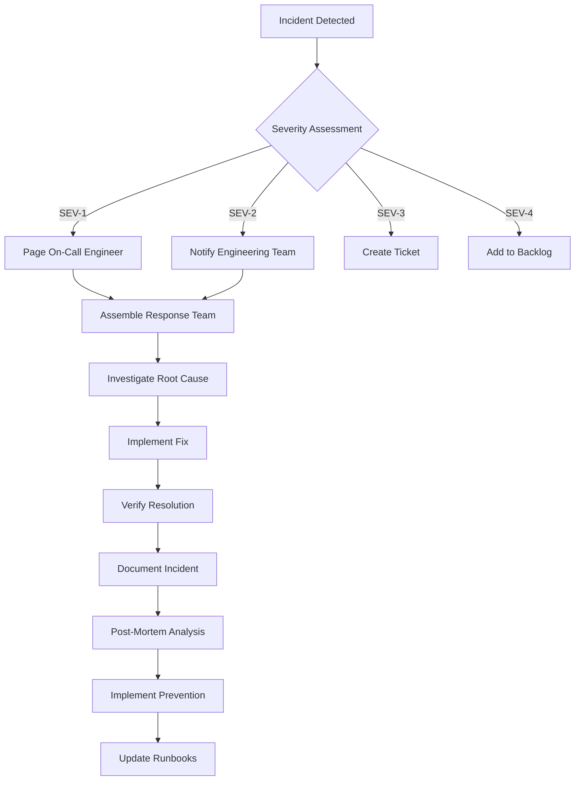

# File 10: Maintenance Guide (`maintenance-guide.md`)
**Location:** `~/.venice/agent-trinity/integration-explainer/maintenance-guide.md`

```markdown
# MAINTENANCE GUIDE
## Agent Trinity Platform - Version 1.0.0

## 📋 Table of Contents
1. [Maintenance Philosophy](#maintenance-philosophy)
2. [Daily Operations](#daily-operations)
3. [Weekly Maintenance](#weekly-maintenance)
4. [Monthly Maintenance](#monthly-maintenance)
5. [Quarterly Maintenance](#quarterly-maintenance)
6. [Incident Response](#incident-response)
7. [Performance Monitoring](#performance-monitoring)
8. [Security Maintenance](#security-maintenance)
9. [Database Maintenance](#database-maintenance)
10. [Infrastructure Maintenance](#infrastructure-maintenance)
11. [Codebase Maintenance](#codebase-maintenance)
12. [Dependency Management](#dependency-management)
13. [Backup & Recovery](#backup-recovery)
14. [Scaling Procedures](#scaling-procedures)
15. [Documentation Maintenance](#documentation-maintenance)
16. [Team Responsibilities](#team-responsibilities)
17. [Contact & Support](#contact-support)

---

## 1. MAINTENANCE PHILOSOPHY

### 1.1 Proactive vs Reactive Maintenance
```
✅ **Proactive Maintenance (Recommended)**
- Regular health checks
- Automated monitoring
- Scheduled updates
- Performance optimization
- Security patching
- Capacity planning

❌ **Reactive Maintenance (Avoid)**
- Waiting for failures
- Emergency patches
- Firefighting
- User-reported issues
- Downtime crises
```

### 1.2 Maintenance Levels
- **Level 1 (Critical):** Security patches, critical bugs, system outages
- **Level 2 (High):** Performance issues, data inconsistencies, major features
- **Level 3 (Medium):** Minor bugs, UI improvements, documentation updates
- **Level 4 (Low):** Code cleanup, refactoring, tech debt reduction

### 1.3 Maintenance Windows
```
🕐 **Scheduled Maintenance Windows**
- Daily: 02:00-03:00 UTC (Low-traffic period)
- Weekly: Sunday 02:00-04:00 UTC
- Monthly: First Sunday of month 02:00-06:00 UTC
- Quarterly: First weekend of quarter 02:00-08:00 UTC
```

---

## 2. DAILY OPERATIONS

### 2.1 Morning Checks (08:00 UTC)
```bash
# Check system health
pnpm run health:check

# Check error rates
pnpm run monitoring:errors

# Check database connections
pnpm run db:health

# Check API status
pnpm run api:status
```

### 2.2 Automated Health Monitoring
```yaml
# monitoring/daily-checks.yml
checks:
  - name: "API Health"
    command: "curl -f https://api.agent-trinity.com/health"
    frequency: "5m"
    threshold: 3
    alert_channels: ["slack", "email"]
    
  - name: "Database Connectivity"
    command: "pnpm run db:ping"
    frequency: "5m"
    threshold: 2
    alert_channels: ["slack", "pagerduty"]
    
  - name: "Queue Depth"
    command: "redis-cli llen job:queue"
    frequency: "1m"
    threshold: 1000
    alert_channels: ["slack"]
```

### 2.3 Daily Checklist
- [ ] Review error logs from previous 24 hours
- [ ] Check system metrics dashboard
- [ ] Verify backups completed successfully
- [ ] Monitor API response times
- [ ] Check queue processing rates
- [ ] Review security alerts
- [ ] Validate monitoring alerts are working

### 2.4 Quick Health Commands
```bash
# System health
./scripts/health.sh

# Database health
./scripts/db-health.sh

# API health
curl -H "Authorization: Bearer $API_KEY" https://api.agent-trinity.com/health

# Cache health
redis-cli ping

# Storage health
aws s3 ls s3://agent-trinity-backups/
```

---

## 3. WEEKLY MAINTENANCE

### 3.1 Weekly Tasks (Sunday 02:00 UTC)
```bash
# 1. Update dependencies
pnpm update --latest

# 2. Run security scan
pnpm run security:scan

# 3. Clean up old logs
pnpm run logs:cleanup

# 4. Optimize database
pnpm run db:optimize

# 5. Clear cache
pnpm run cache:clear

# 6. Backup verification
pnpm run backup:verify
```

### 3.2 Weekly Reports
```bash
# Generate weekly report
pnpm run report:weekly

# Report includes:
# - System uptime (target: 99.9%)
# - API performance (P95 response time)
# - Error rates (target: < 0.1%)
# - User growth
# - Feature usage
# - Cost analysis
# - Security incidents
```

### 3.3 Database Maintenance
```sql
-- Weekly database maintenance
VACUUM ANALYZE;
REINDEX TABLE conversations;
REINDEX TABLE messages;
REINDEX TABLE agents;

-- Update statistics
ANALYZE;

-- Check for bloat
SELECT
  schemaname,
  tablename,
  pg_size_pretty(pg_total_relation_size(schemaname||'.'||tablename)) as size,
  n_dead_tup,
  n_live_tup
FROM pg_stat_user_tables
WHERE n_dead_tup > 10000
ORDER BY n_dead_tup DESC;
```

### 3.4 Log Rotation
```yaml
# config/logrotate.yml
paths:
  - /var/log/agent-trinity/*.log
  
rules:
  - size: "100M"
    compress: true
    compress_cmd: gzip
    compress_options: ["-9"]
    copytruncate: true
    create: true
    create_mode: "0640"
    create_owner: "appuser"
    create_group: "appgroup"
    rotate: 10
    rotate_every: "week"
```

---

## 4. MONTHLY MAINTENANCE

### 4.1 Monthly Tasks (First Sunday 02:00 UTC)
```bash
# 1. Comprehensive security audit
pnpm run security:audit

# 2. Performance analysis
pnpm run performance:analyze

# 3. Cost optimization review
pnpm run cost:optimize

# 4. Capacity planning
pnpm run capacity:plan

# 5. Documentation audit
pnpm run docs:audit

# 6. Dependency audit
pnpm run deps:audit
```

### 4.2 Monthly Health Check
```typescript
// scripts/monthly-health-check.ts
import { HealthChecker } from '../lib/health';
import { DatabaseAuditor } from '../lib/db-audit';
import { SecurityScanner } from '../lib/security';
import { PerformanceAnalyzer } from '../lib/performance';

export async function monthlyHealthCheck() {
  console.log('🩺 Starting monthly health check...');
  
  // 1. System health
  const healthChecker = new HealthChecker();
  const systemHealth = await healthChecker.runComprehensiveCheck();
  
  if (!systemHealth.healthy) {
    console.error('❌ System health check failed:', systemHealth.issues);
    throw new Error('System health check failed');
  }
  
  // 2. Database audit
  const dbAuditor = new DatabaseAuditor();
  const dbReport = await dbAuditor.audit({
    checkIndexes: true,
    checkVacuum: true,
    checkConnections: true,
    checkReplication: true,
  });
  
  // 3. Security scan
  const securityScanner = new SecurityScanner();
  const securityReport = await securityScanner.scan({
    checkVulnerabilities: true,
    checkCompliance: true,
    checkPermissions: true,
    checkLogging: true,
  });
  
  // 4. Performance analysis
  const performanceAnalyzer = new PerformanceAnalyzer();
  const performanceReport = await performanceAnalyzer.analyze({
    timeRange: '30d',
    metrics: ['response_time', 'error_rate', 'throughput', 'latency'],
  });
  
  // Generate report
  const report = {
    timestamp: new Date().toISOString(),
    systemHealth,
    dbReport,
    securityReport,
    performanceReport,
    recommendations: [
      ...systemHealth.recommendations,
      ...dbReport.recommendations,
      ...securityReport.recommendations,
      ...performanceReport.recommendations,
    ],
  };
  
  console.log('✅ Monthly health check completed');
  return report;
}
```

### 4.3 Cost Optimization
```bash
# Analyze AWS costs
aws ce get-cost-and-usage \
  --time-period Start=2024-01-01,End=2024-01-31 \
  --granularity MONTHLY \
  --metrics "BlendedCost" "UnblendedCost" "UsageQuantity" \
  --group-by Type=DIMENSION,Key=SERVICE

# Analyze database costs
SELECT
  query,
  calls,
  total_exec_time,
  mean_exec_time,
  (total_exec_time * 0.000002) as estimated_cost_usd
FROM pg_stat_statements
ORDER BY total_exec_time DESC
LIMIT 20;

# Analyze storage costs
du -sh /var/lib/agent-trinity/*
aws s3 ls --recursive --human-readable s3://agent-trinity-backups/
```

### 4.4 User Feedback Review
```typescript
// scripts/review-feedback.ts
export async function reviewMonthlyFeedback() {
  const feedback = await db.query(`
    SELECT 
      category,
      COUNT(*) as count,
      AVG(rating) as avg_rating,
      ARRAY_AGG(DISTINCT SUBSTRING(feedback, 1, 100)) as samples
    FROM user_feedback
    WHERE created_at >= NOW() - INTERVAL '30 days'
    GROUP BY category
    ORDER BY count DESC
  `);
  
  const issues = await db.query(`
    SELECT 
      type,
      COUNT(*) as occurrences,
      COUNT(DISTINCT user_id) as affected_users,
      AVG(resolution_time_minutes) as avg_resolution_time
    FROM support_issues
    WHERE created_at >= NOW() - INTERVAL '30 days'
      AND resolved = true
    GROUP BY type
    ORDER BY occurrences DESC
  `);
  
  return {
    feedback,
    issues,
    recommendations: generateRecommendations(feedback, issues),
  };
}
```

---

## 5. QUARTERLY MAINTENANCE

### 5.1 Quarterly Review (First weekend of quarter)
```bash
# 1. Architecture review
pnpm run architecture:review

# 2. Technology stack evaluation
pnpm run tech:review

# 3. Team process review
pnpm run process:review

# 4. Business metrics review
pnpm run metrics:review

# 5. Disaster recovery test
pnpm run disaster:recovery:test

# 6. Compliance audit
pnpm run compliance:audit
```

### 5.2 Architecture Review
```typescript
// scripts/architecture-review.ts
export async function conductArchitectureReview() {
  const review = {
    date: new Date().toISOString(),
    quarter: getCurrentQuarter(),
    participants: ['tech-lead', 'senior-dev', 'product-manager', 'devops'],
    
    sections: {
      // 1. Scalability Assessment
      scalability: {
        currentCapacity: await assessCurrentCapacity(),
        projectedGrowth: await calculateProjectedGrowth(),
        bottlenecks: await identifyBottlenecks(),
        recommendations: await generateScalabilityRecommendations(),
      },
      
      // 2. Technology Stack
      technology: {
        currentStack: await getCurrentTechnologyStack(),
        newTechnologies: await evaluateNewTechnologies(),
        upgradePaths: await planTechnologyUpgrades(),
        deprecations: await identifyUpcomingDeprecations(),
      },
      
      // 3. Code Quality
      codeQuality: {
        complexityMetrics: await calculateCodeComplexity(),
        technicalDebt: await assessTechnicalDebt(),
        testCoverage: await analyzeTestCoverage(),
        documentationCoverage: await analyzeDocumentationCoverage(),
      },
      
      // 4. Security Posture
      security: {
        vulnerabilities: await scanForVulnerabilities(),
        complianceStatus: await checkCompliance(),
        securityIncidents: await reviewSecurityIncidents(),
        penetrationTestResults: await reviewPentestResults(),
      },
      
      // 5. Cost Efficiency
      costEfficiency: {
        currentCosts: await analyzeCurrentCosts(),
        optimizationOpportunities: await identifyCostSavings(),
        roiAnalysis: await calculateROI(),
        budgetProjection: await projectNextQuarterBudget(),
      },
    },
  };
  
  return review;
}
```

### 5.3 Disaster Recovery Test
```bash
# Disaster recovery test script
#!/bin/bash

echo "🚨 Starting quarterly disaster recovery test..."

# 1. Simulate database failure
echo "1. Simulating database failure..."
docker-compose -f docker-compose.prod.yml stop postgres

# 2. Verify failover
echo "2. Verifying failover to replica..."
sleep 30
curl -f https://api.agent-trinity.com/health || echo "Failover failed"

# 3. Restore from backup
echo "3. Testing backup restoration..."
./scripts/restore-backup.sh --test-mode

# 4. Verify data integrity
echo "4. Verifying data integrity..."
pnpm run db:verify-integrity

# 5. Test monitoring alerts
echo "5. Testing monitoring alerts..."
./scripts/test-alerts.sh

# 6. Document results
echo "6. Documenting test results..."
./scripts/generate-dr-report.sh

echo "✅ Disaster recovery test completed"
```

### 5.4 Compliance Audit
```typescript
// scripts/compliance-audit.ts
export async function conductComplianceAudit() {
  const standards = {
    gdpr: {
      requirements: [
        'data_minimization',
        'right_to_access',
        'right_to_erasure',
        'data_portability',
        'privacy_by_design',
      ],
      checks: await checkGDPRCompliance(),
    },
    
    ccpa: {
      requirements: [
        'right_to_know',
        'right_to_delete',
        'right_to_opt_out',
        'non_discrimination',
      ],
      checks: await checkCCPACompliance(),
    },
    
    hipaa: {
      requirements: [
        'access_controls',
        'audit_controls',
        'integrity_controls',
        'transmission_security',
      ],
      checks: await checkHIPAACompliance(),
    },
    
    soc2: {
      requirements: [
        'security',
        'availability',
        'processing_integrity',
        'confidentiality',
        'privacy',
      ],
      checks: await checkSOC2Compliance(),
    },
  };
  
  const auditReport = {
    timestamp: new Date().toISOString(),
    auditor: 'Automated Compliance Auditor',
    standards,
    findings: await generateFindings(standards),
    recommendations: await generateRecommendations(standards),
    nextAuditDate: calculateNextAuditDate(),
  };
  
  return auditReport;
}
```

---

## 6. INCIDENT RESPONSE

### 6.1 Incident Severity Levels
```
SEV-1 (Critical)
- Production system down
- Data loss/corruption
- Security breach
- SLA violation > 1 hour
Response Time: 15 minutes
Resolution Time: 1 hour

SEV-2 (High)
- Major feature broken
- Performance degradation > 50%
- Partial outage
- SLA violation < 1 hour
Response Time: 30 minutes
Resolution Time: 4 hours

SEV-3 (Medium)
- Minor feature broken
- Performance degradation < 50%
- Non-critical bugs
Response Time: 2 hours
Resolution Time: 24 hours

SEV-4 (Low)
- Cosmetic issues
- Documentation errors
- Enhancement requests
Response Time: 24 hours
Resolution Time: 1 week
```

### 6.2 Incident Response Process


### 6.3 Incident Runbook Template
```markdown
# INCIDENT RUNBOOK: [INCIDENT_NAME]

## 🚨 Incident Details
- **Incident ID:** INC-YYYY-MM-DD-001
- **Severity:** SEV-1/2/3/4
- **Start Time:** [Timestamp]
- **Detection Method:** [Monitoring Alert/User Report/Etc]
- **Affected Systems:** [List systems]
- **Impact:** [User Impact Description]

## 👥 Response Team
- **Incident Commander:** [Name]
- **Technical Lead:** [Name]
- **Communications Lead:** [Name]
- **Supporting Engineers:** [Names]

## 📋 Initial Assessment
- [ ] Confirm incident severity
- [ ] Assemble response team
- [ ] Establish communication channels
- [ ] Begin timeline documentation

## 🔍 Investigation Steps
1. **Check Monitoring Dashboards**
   ```bash
   # Check system metrics
   kubectl top pods -n agent-trinity
   
   # Check database metrics
   pnpm run db:metrics
   
   # Check application logs
   pnpm run logs:tail --since="5m"
   ```

2. **Identify Root Cause**
   ```bash
   # Check recent deployments
   git log --oneline -n 10
   
   # Check configuration changes
   git diff HEAD~5 HEAD -- config/
   
   # Check external dependencies
   curl https://status.openai.com
   curl https://status.anthropic.com
   ```

3. **Isolate Issue**
   ```bash
   # Restart affected component
   kubectl rollout restart deployment/[deployment-name]
   
   # Scale up resources
   kubectl scale deployment/[deployment-name] --replicas=3
   
   # Route traffic away
   kubectl apply -f config/disable-ingress.yaml
   ```

## 🛠️ Resolution Steps
1. **Immediate Mitigation**
   ```bash
   # Rollback if needed
   kubectl rollout undo deployment/[deployment-name]
   
   # Enable maintenance mode
   pnpm run maintenance:enable
   ```

2. **Permanent Fix**
   ```bash
   # Apply hotfix
   git checkout -b hotfix/incident-001
   # Make fix
   git commit -m "Fix: [description]"
   git push origin hotfix/incident-001
   ```

3. **Verification**
   ```bash
   # Verify fix
   pnpm run test:smoke
   
   # Monitor metrics
   pnpm run monitoring:dashboard --watch
   
   # User verification
   curl https://api.agent-trinity.com/health
   ```

## 📢 Communication Plan
- **Internal:** Slack channel #incidents
- **External:** Status page updates
- **Customers:** Email notifications if >30m outage
- **Stakeholders:** Executive brief if SEV-1/2

## 📝 Post-Incident Actions
- [ ] Conduct post-mortem within 48 hours
- [ ] Document lessons learned
- [ ] Update runbooks
- [ ] Implement prevention measures
- [ ] Schedule follow-up review
```

### 6.4 Common Incident Scenarios
#### Scenario 1: Database Connection Pool Exhaustion
```bash
# Symptoms
- High database connection count
- Slow query response times
- Application timeouts

# Immediate Actions
1. Increase connection pool size
   ```
   export DATABASE_POOL_SIZE=100
   kubectl set env deployment/api DATABASE_POOL_SIZE=100
   ```

2. Kill idle connections
   ```sql
   SELECT pg_terminate_backend(pid)
   FROM pg_stat_activity
   WHERE state = 'idle'
     AND now() - state_change > interval '5 minutes';
   ```

3. Restart application
   ```
   kubectl rollout restart deployment/api
   ```

# Root Cause Analysis
- Check for connection leaks
- Review connection pool configuration
- Analyze query patterns

# Prevention
- Implement connection pooling
- Add connection timeout
- Monitor connection count
```

#### Scenario 2: API Rate Limit Exceeded
```bash
# Symptoms
- 429 Too Many Requests errors
- External API failures
- User requests failing

# Immediate Actions
1. Implement exponential backoff
   ```
   // Retry with backoff
   async function callWithRetry(apiCall, maxRetries = 3) {
     for (let i = 0; i < maxRetries; i++) {
       try {
         return await apiCall();
       } catch (error) {
         if (error.status !== 429) throw error;
         await sleep(Math.pow(2, i) * 1000);
       }
     }
   }
   ```

2. Cache responses
   ```
   // Cache API responses
   redis.setex(`api:${endpoint}:${params}`, 300, response);
   ```

3. Queue requests
   ```
   // Use message queue
   await queue.add('api-request', { endpoint, params });
   ```

# Prevention
- Implement rate limiting
- Use API caching
- Monitor API usage
- Request higher rate limits
```

---

## 7. PERFORMANCE MONITORING

### 7.1 Key Performance Indicators (KPIs)
```yaml
# monitoring/kpis.yml
kpis:
  # Application KPIs
  application:
    - name: "API Response Time (P95)"
      target: "< 500ms"
      warning: "500ms - 1000ms"
      critical: "> 1000ms"
      
    - name: "Error Rate"
      target: "< 0.1%"
      warning: "0.1% - 1%"
      critical: "> 1%"
      
    - name: "Request Throughput"
      target: "> 1000 RPM"
      warning: "500 - 1000 RPM"
      critical: "< 500 RPM"
      
    - name: "Uptime"
      target: "> 99.9%"
      warning: "99% - 99.9%"
      critical: "< 99%"
  
  # Database KPIs
  database:
    - name: "Query Performance (P95)"
      target: "< 100ms"
      warning: "100ms - 500ms"
      critical: "> 500ms"
      
    - name: "Connection Pool Utilization"
      target: "< 70%"
      warning: "70% - 90%"
      critical: "> 90%"
      
    - name: "Cache Hit Ratio"
      target: "> 95%"
      warning: "90% - 95%"
      critical: "< 90%"
  
  # Infrastructure KPIs
  infrastructure:
    - name: "CPU Utilization"
      target: "< 70%"
      warning: "70% - 85%"
      critical: "> 85%"
      
    - name: "Memory Utilization"
      target: "< 80%"
      warning: "80% - 90%"
      critical: "> 90%"
      
    - name: "Disk I/O"
      target: "< 70%"
      warning: "70% - 85%"
      critical: "> 85%"
```

7.2 Performance Monitoring Setup
typescript
// monitoring/setup.ts
import { MonitoringService } from './monitoring-service';
import { AlertManager } from './alert-manager';
import { PerformanceTracker } from './performance-tracker';

export async function setupPerformanceMonitoring() {
  const monitoring = new MonitoringService({
    serviceName: 'agent-trinity',
    environment: process.env.NODE_ENV,
    
    // Application metrics
    applicationMetrics: {
      enableRequestTracking: true,
      enableErrorTracking: true,
      enableBusinessMetrics: true,
      sampleRate: 1.0, // 100% sampling
    },
    
    // Infrastructure metrics
    infrastructureMetrics: {
      enableCPU: true,
      enableMemory: true,
      enableDisk: true,
      enableNetwork: true,
    },
    
    // Database metrics
    databaseMetrics: {
      enableQueryTracking: true,
      enableConnectionPoolTracking: true,
      enableReplicationTracking: true,
    },
    
    // External services
    externalServices: {
      openai: true,
      anthropic: true,
      supabase: true,
      redis: true,
    },
  });
  
  const alerts = new AlertManager({
    notificationChannels: ['slack', 'email', 'pagerduty'],
    
    alertRules: {
      responseTime: {
        threshold: 1000, // ms
        window: '5m',
        aggregation: 'p95',
      },
      
      errorRate: {
        threshold: 1, // percent
        window: '5m',
        aggregation: 'avg',
      },
      
      cpuUsage: {
        threshold: 85, // percent
        window: '5m',
        aggregation: 'avg',
      },
    },
  });
  
  const performance = new PerformanceTracker({
    storage: {
      type: 'timeseries',
      retention: '30d',
    },
    
    reporting: {
      enableDailyReports: true,
      enableWeeklyReports: true,
      enableMonthlyReports: true,
    },
    
    analysis: {
      enableTrendAnalysis: true,
      enableAnomalyDetection: true,
      enableForecasting: true,
    },
  });
  
  await monitoring.start();
  await alerts.start();
  await performance.start();
  
  return { monitoring, alerts, performance };
}
7.3 Performance Analysis Tools
bash
# Real-time monitoring
pnpm run monitoring:dashboard

# Performance profiling
pnpm run profile:cpu
pnpm run profile:memory
pnpm run profile:heap

# Database performance
pnpm run db:explain --query="SELECT * FROM conversations WHERE user_id = ?"
pnpm run db:indexes
pnpm run db:vacuum

# Network performance
pnpm run network:latency
pnpm run network:throughput

# Load testing
pnpm run load:test --users=100 --duration=5m
pnpm run stress:test --users=500 --duration=10m

8. SECURITY MAINTENANCE
8.1 Security Patch Management
bash
# Weekly security updates
#!/bin/bash

echo "🔒 Running security updates..."

# Update npm dependencies
npm audit fix --force

# Update system packages
apt-get update && apt-get upgrade -y

# Update Docker images
docker-compose pull

# Scan for vulnerabilities
trivy image agent-trinity:latest
snyk test
npm audit
pip-audit

# Generate report
./scripts/security-report.sh

#### 8.3 Cloud Resource Optimization
```yaml
# infrastructure/terraform/main.tf - Example resource optimization
resource "aws_lambda_function" "api_handler" {
  function_name = "agent-platform-api"
  runtime       = "nodejs20.x"
  memory_size   = 1024
  timeout       = 30
  
  # Auto-scaling configuration
  reserved_concurrent_executions = 100
  provisioned_concurrent_executions = {
    enabled = true
    value   = 10
  }
}

# Cost optimization through scheduled scaling
resource "aws_appautoscaling_scheduled_action" "nightly_scale_down" {
  name               = "nightly-scale-down"
  service_namespace  = "lambda"
  resource_id        = "function:${aws_lambda_function.api_handler.function_name}"
  scalable_dimension = "lambda:function:ProvisionedConcurrency"
  schedule           = "cron(0 0 * * ? *)"  # Daily at midnight UTC
  scalable_target_action {
    min_capacity = 1
    max_capacity = 1
  }
}
```

#### 8.4 Database Maintenance Operations
```sql
-- Monthly maintenance tasks
CREATE OR REPLACE FUNCTION monthly_maintenance()
RETURNS void AS $$
BEGIN
  -- Update statistics
  ANALYZE;
  
  -- Vacuum tables with high churn
  VACUUM (VERBOSE, ANALYZE) users, sessions, audit_logs;
  
  -- Clean up old data
  DELETE FROM audit_logs 
  WHERE created_at < NOW() - INTERVAL '90 days';
  
  -- Reindex heavily fragmented indexes
  REINDEX INDEX CONCURRENTLY idx_users_email;
  REINDEX INDEX CONCURRENTLY idx_sessions_user_id;
END;
$$ LANGUAGE plpgsql;

-- Schedule via pg_cron
SELECT cron.schedule(
  'monthly-maintenance',
  '0 2 1 * *',  -- First day of month at 2 AM
  'CALL monthly_maintenance()'
);
```

#### 8.5 CDN Cache Management
```typescript
// utils/cdn-maintenance.ts
export class CDNMaintenance {
  static async purgeStaleAssets(): Promise<void> {
    const stalePatterns = [
      '/_next/static/chunks/*.js',
      '/_next/static/css/*.css',
      '/api/cache/*',
    ]
    
    // Purge Vercel Edge Cache
    await fetch(`https://api.vercel.com/v1/edge-config/purge`, {
      method: 'POST',
      headers: {
        Authorization: `Bearer ${process.env.VERCEL_TOKEN}`,
      },
      body: JSON.stringify({
        paths: stalePatterns,
      }),
    })
    
    // Purge Cloudflare Cache
    await fetch(`https://api.cloudflare.com/client/v4/zones/${process.env.CLOUDFLARE_ZONE_ID}/purge_cache`, {
      method: 'POST',
      headers: {
        Authorization: `Bearer ${process.env.CLOUDFLARE_TOKEN}`,
        'Content-Type': 'application/json',
      },
      body: JSON.stringify({
        files: stalePatterns.map(pattern => `https://${process.env.NEXT_PUBLIC_APP_DOMAIN}${pattern}`),
      }),
    })
  }
  
  static async optimizeCacheRules(): Promise<void> {
    const rules = {
      static: {
        path: '/_next/static/**',
        ttl: 31536000, // 1 year
        swr: 86400,     // 1 day stale-while-revalidate
      },
      api: {
        path: '/api/**',
        ttl: 300,       // 5 minutes
        swr: 60,        // 1 minute stale-while-revalidate
      },
      pages: {
        path: '/**',
        ttl: 3600,      // 1 hour
        swr: 300,       // 5 minutes stale-while-revalidate
      },
    }
    
    await this.updateCacheConfiguration(rules)
  }
}
```

#### 8.6 Monitoring and Alert Cleanup
```yaml
# monitoring/alert-cleanup.yml
alert_maintenance:
  schedule: "0 3 * * *"  # Daily at 3 AM
  tasks:
    - name: "Resolve stale alerts"
      query: |
        ALERT severity != "critical"
        AND status = "firing"
        AND timestamp < now() - 24h
      action: "resolve"
      comment: "Auto-resolved after 24h"
      
    - name: "Archive old incidents"
      query: |
        ALERT status = "resolved"
        AND resolved_at < now() - 30d
      action: "archive"
      
    - name: "Cleanup old metrics"
      query: |
        METRIC __name__ =~ ".*"
        AND timestamp < now() - 90d
      action: "delete"
```

#### 8.7 Backup Verification
```typescript
// scripts/verify-backups.ts
export async function verifyBackups(): Promise<VerificationResult> {
  const backupSources = [
    {
      type: 'database',
      path: `s3://${process.env.BACKUP_BUCKET}/postgres/daily/`,
      retention: 30,
      verification: {
        checksum: true,
        restoreTest: true,
        sizeValidation: true,
      },
    },
    {
      type: 'uploads',
      path: `s3://${process.env.BACKUP_BUCKET}/uploads/hourly/`,
      retention: 7,
      verification: {
        checksum: true,
        integrity: true,
      },
    },
    {
      type: 'logs',
      path: `s3://${process.env.BACKUP_BUCKET}/logs/daily/`,
      retention: 90,
      verification: {
        compression: true,
        accessibility: true,
      },
    },
  ]
  
  const results: VerificationResult[] = []
  
  for (const source of backupSources) {
    const verification = await verifyBackupSource(source)
    results.push({
      source: source.type,
      status: verification.success ? 'healthy' : 'failed',
      details: verification,
      timestamp: new Date().toISOString(),
    })
    
    if (!verification.success) {
      await sendAlert({
        severity: 'critical',
        message: `Backup verification failed for ${source.type}`,
        details: verification.errors,
      })
    }
  }
  
  return { overall: results.every(r => r.status === 'healthy'), details: results }
}
```

### 9. Documentation Maintenance (New Section)

#### 9.1 Automated Documentation Updates
```typescript
// scripts/update-docs.ts
export class DocumentationMaintenance {
  static async syncOpenAPISpec(): Promise<void> {
    // Generate OpenAPI spec from code
    const spec = await generateOpenAPISpec()
    
    // Update API documentation
    await fs.writeFile(
      './docs/api/openapi.json',
      JSON.stringify(spec, null, 2)
    )
    
    // Upload to documentation platform
    await uploadToReadme(spec)
  }
  
  static async validateLinks(): Promise<void> {
    const brokenLinks = await checkBrokenLinks('./docs')
    
    if (brokenLinks.length > 0) {
      console.warn('Found broken links:', brokenLinks)
      await createGitHubIssue({
        title: 'Broken documentation links',
        body: `Please fix:\n${brokenLinks.map(link => `- ${link}`).join('\n')}`,
        labels: ['documentation', 'bug'],
      })
    }
  }
}
```

#### 9.2 Changelog Management
```markdown
<!-- .github/changelog-template.md -->
## {{version}} - {{date}}

### 🚀 New Features
{{#each features}}
- {{this}}
{{/each}}

### 🐛 Bug Fixes
{{#each bugfixes}}
- {{this}}
{{/each}}

### 🔧 Improvements
{{#each improvements}}
- {{this}}
{{/each}}

### 📚 Documentation
{{#each documentation}}
- {{this}}
{{/each}}

### ⚡ Performance
{{#each performance}}
- {{this}}
{{/each}}

### 🔒 Security
{{#each security}}
- {{this}}
{{/each}}
```

### 10. Community and Support (New Section)

#### 10.1 Issue Triage Workflow
```yaml
# .github/issue-triage.yml
name: Issue Triage
on:
  issues:
    types: [opened]

jobs:
  triage:
    runs-on: ubuntu-latest
    steps:
      - name: Check issue content
        uses: actions/github-script@v7
        with:
          script: |
            const issue = context.payload.issue
            const labels = []
            
            // Categorize by title/keywords
            if (issue.title.includes('[BUG]') || issue.body.includes('error')) {
              labels.push('bug')
            }
            if (issue.title.includes('[FEATURE]')) {
              labels.push('enhancement')
            }
            if (issue.body.includes('security') || issue.body.includes('vulnerability')) {
              labels.push('security')
            }
            
            // Add priority based on engagement
            if (issue.comments > 5) {
              labels.push('priority-high')
            }
            
            // Apply labels
            await github.rest.issues.addLabels({
              owner: context.repo.owner,
              repo: context.repo.repo,
              issue_number: issue.number,
              labels: labels,
            })
```

#### 10.2 Support Response Templates
```typescript
// support/templates.ts
export const supportTemplates = {
  bugReport: {
    subject: 'Bug Report: {{summary}}',
    body: `## Bug Description
{{description}}

## Steps to Reproduce
1. {{step1}}
2. {{step2}}
3. {{step3}}

## Expected Behavior
{{expected}}

## Actual Behavior
{{actual}}

## Environment
- Platform: {{platform}}
- Browser: {{browser}}
- Version: {{version}}`,
  },
  
  featureRequest: {
    subject: 'Feature Request: {{feature}}',
    body: `## Problem Statement
{{problem}}

## Proposed Solution
{{solution}}

## Use Cases
{{useCases}}

## Alternatives Considered
{{alternatives}}`,
  },
}
```
```yaml
            name: agent-trinity-api
            port:
              number: 8080
      - path: /admin
        pathType: Prefix
        backend:
          service:
            name: agent-trinity-admin
            port:
              number: 8081
      - path: /monitoring
        pathType: Prefix
        backend:
          service:
            name: agent-trinity-monitoring
            port:
              number: 3001
```

## **11. CODEBASE MAINTENANCE**

### **11.1 Code Quality Standards**

```typescript
// .eslintrc.js - Extended for maintenance
module.exports = {
  extends: [
    'next/core-web-vitals',
    'plugin:@typescript-eslint/recommended',
    'plugin:react-hooks/recommended',
    'plugin:jsx-a11y/recommended',
    'prettier',
  ],
  plugins: ['deprecation', 'import', 'unused-imports'],
  rules: {
    // Code quality rules
    'complexity': ['error', 10],
    'max-depth': ['error', 4],
    'max-nested-callbacks': ['error', 3],
    'max-params': ['error', 4],
    'max-lines-per-function': ['error', 50],
    'max-lines': ['error', 300],
    
    // Deprecation warnings
    'deprecation/deprecation': 'warn',
    
    // Import organization
    'import/order': ['error', {
      'groups': [
        'builtin',
        'external',
        'internal',
        'parent',
        'sibling',
        'index',
      ],
      'newlines-between': 'always',
      'alphabetize': { 'order': 'asc', 'caseInsensitive': true },
    }],
    
    // Unused imports
    'unused-imports/no-unused-imports': 'error',
    'unused-imports/no-unused-vars': [
      'warn',
      {
        'vars': 'all',
        'varsIgnorePattern': '^_',
        'args': 'after-used',
        'argsIgnorePattern': '^_',
      },
    ],
    
    // TypeScript specific
    '@typescript-eslint/no-explicit-any': 'error',
    '@typescript-eslint/explicit-function-return-type': [
      'error',
      {
        'allowExpressions': true,
        'allowTypedFunctionExpressions': true,
      },
    ],
    '@typescript-eslint/no-unused-vars': ['error', {
      'argsIgnorePattern': '^_',
      'varsIgnorePattern': '^_',
    }],
  },
};
```

### **11.2 Technical Debt Management**

```typescript
// technical-debt-tracker.ts
interface TechnicalDebtItem {
  id: string;
  title: string;
  description: string;
  location: string; // file path
  severity: 'low' | 'medium' | 'high' | 'critical';
  category: 'performance' | 'security' | 'maintainability' | 'testability' | 'documentation';
  created: Date;
  estimatedEffort: number; // in hours
  businessImpact: 'low' | 'medium' | 'high';
  dependencies?: string[]; // related debt items
  status: 'open' | 'in-progress' | 'resolved' | 'deferred';
  resolvedAt?: Date;
  resolution?: string;
}

class TechnicalDebtTracker {
  private debts: Map<string, TechnicalDebtItem> = new Map();
  
  addDebt(item: Omit<TechnicalDebtItem, 'id' | 'created' | 'status'>): string {
    const id = `debt-${Date.now()}-${Math.random().toString(36).substr(2, 9)}`;
    const debt: TechnicalDebtItem = {
      ...item,
      id,
      created: new Date(),
      status: 'open',
    };
    
    this.debts.set(id, debt);
    this.saveToStorage();
    return id;
  }
  
  getDebtById(id: string): TechnicalDebtItem | undefined {
    return this.debts.get(id);
  }
  
  getDebtsBySeverity(severity: TechnicalDebtItem['severity']): TechnicalDebtItem[] {
    return Array.from(this.debts.values())
      .filter(debt => debt.severity === severity)
      .sort((a, b) => b.created.getTime() - a.created.getTime());
  }
  
  getDebtsByCategory(category: TechnicalDebtItem['category']): TechnicalDebtItem[] {
    return Array.from(this.debts.values())
      .filter(debt => debt.category === category)
      .sort((a, b) => b.created.getTime() - a.created.getTime());
  }
  
  updateDebtStatus(id: string, status: TechnicalDebtItem['status'], resolution?: string): void {
    const debt = this.debts.get(id);
    if (debt) {
      debt.status = status;
      if (status === 'resolved') {
        debt.resolvedAt = new Date();
        debt.resolution = resolution;
      }
      this.debts.set(id, debt);
      this.saveToStorage();
    }
  }
  
  calculateTotalDebt(): {
    count: number;
    estimatedEffort: number;
    bySeverity: Record<string, number>;
    byCategory: Record<string, number>;
  } {
    const debts = Array.from(this.debts.values());
    const openDebts = debts.filter(d => d.status === 'open');
    
    return {
      count: openDebts.length,
      estimatedEffort: openDebts.reduce((sum, debt) => sum + debt.estimatedEffort, 0),
      bySeverity: openDebts.reduce((acc, debt) => {
        acc[debt.severity] = (acc[debt.severity] || 0) + 1;
        return acc;
      }, {} as Record<string, number>),
      byCategory: openDebts.reduce((acc, debt) => {
        acc[debt.category] = (acc[debt.category] || 0) + 1;
        return acc;
      }, {} as Record<string, number>),
    };
  }
  
  generateReport(): string {
    const totalDebt = this.calculateTotalDebt();
    
    let report = '# Technical Debt Report\n\n';
    report += `**Generated:** ${new Date().toLocaleString()}\n`;
    report += `**Total Open Debt Items:** ${totalDebt.count}\n`;
    report += `**Total Estimated Effort:** ${totalDebt.estimatedEffort} hours\n\n`;
    
    report += '## By Severity\n\n';
    Object.entries(totalDebt.bySeverity).forEach(([severity, count]) => {
      report += `- ${severity.toUpperCase()}: ${count} items\n`;
    });
    
    report += '\n## By Category\n\n';
    Object.entries(totalDebt.byCategory).forEach(([category, count]) => {
      report += `- ${category}: ${count} items\n`;
    });
    
    report += '\n## Critical Debt Items\n\n';
    const criticalDebts = this.getDebtsBySeverity('critical')
      .filter(d => d.status === 'open')
      .slice(0, 10);
    
    if (criticalDebts.length > 0) {
      report += '| Title | Location | Effort (hours) | Impact |\n';
      report += '|-------|----------|----------------|--------|\n';
      criticalDebts.forEach(debt => {
        report += `| ${debt.title} | ${debt.location} | ${debt.estimatedEffort} | ${debt.businessImpact} |\n`;
      });
    } else {
      report += '✅ No critical debt items\n';
    }
    
    report += '\n## Recommendations\n\n';
    if (totalDebt.estimatedEffort > 40) {
      report += '⚠️ **High technical debt detected.** Consider:\n';
      report += '1. Scheduling a debt reduction sprint\n';
      report += '2. Addressing critical items immediately\n';
      report += '3. Preventing new debt with code reviews\n';
    } else {
      report += '✅ **Technical debt is manageable.**\n';
    }
    
    return report;
  }
  
  private saveToStorage(): void {
    // Save to file or database
    const data = Array.from(this.debts.values());
    const fs = require('fs');
    const path = require('path');
    
    const reportDir = path.join(process.cwd(), 'reports', 'technical-debt');
    if (!fs.existsSync(reportDir)) {
      fs.mkdirSync(reportDir, { recursive: true });
    }
    
    const filepath = path.join(reportDir, 'technical-debt.json');
    fs.writeFileSync(filepath, JSON.stringify(data, null, 2));
  }
}

export const technicalDebtTracker = new TechnicalDebtTracker();
```

### **11.3 Code Review Guidelines**

```markdown
# Code Review Guidelines

## 📋 Review Checklist

### 🏗️ Architecture & Design
- [ ] Code follows established patterns
- [ ] No circular dependencies
- [ ] Proper separation of concerns
- [ ] Reasonable component/module size
- [ ] Appropriate abstractions

### 🔒 Security
- [ ] No hardcoded secrets
- [ ] Input validation implemented
- [ ] Output encoding where needed
- [ ] Proper authentication/authorization
- [ ] SQL injection prevention
- [ ] XSS protection
- [ ] CSRF protection

### 🚀 Performance
- [ ] No unnecessary re-renders
- [ ] Efficient algorithms used
- [ ] Proper caching strategies
- [ ] Lazy loading where appropriate
- [ ] Bundle size considered
- [ ] Memory leaks prevented

### 🧪 Testing
- [ ] Tests added/updated
- [ ] Test coverage maintained
- [ ] Edge cases considered
- [ ] Mocks used appropriately
- [ ] Test names descriptive

### 📝 Code Quality
- [ ] Code is readable
- [ ] Consistent formatting
- [ ] Meaningful variable names
- [ ] No commented-out code
- [ ] No dead code
- [ ] Error handling appropriate

### 📚 Documentation
- [ ] Public APIs documented
- [ ] Complex logic commented
- [ ] README updated if needed
- [ ] Type definitions complete
- [ ] JSDoc comments for functions

### 🔧 Maintainability
- [ ] Code is modular
- [ ] No code duplication
- [ ] Configurable, not hardcoded
- [ ] Easy to test
- [ ] Easy to debug

## 🎯 Review Priorities

### Must Fix (Blocking)
- Security vulnerabilities
- Breaking changes
- Performance regressions
- Broken functionality
- Major architectural issues

### Should Fix (Important)
- Code quality issues
- Test gaps
- Documentation gaps
- Minor performance issues
- Inconsistent patterns

### Could Fix (Nice to Have)
- Code style nitpicks
- Minor refactoring opportunities
- Optional optimizations
- Additional test cases

## 💬 Review Etiquette

### As a Reviewer
- Be constructive, not critical
- Explain the "why" behind suggestions
- Focus on the code, not the person
- Acknowledge good code
- Be timely with reviews
- Use inline comments for small issues
- Use summary comments for larger discussions

### As a Reviewee
- Be open to feedback
- Ask clarifying questions
- Don't take feedback personally
- Consider all suggestions
- Push back respectfully when needed
- Thank reviewers for their time

## ⚡ Review Process

1. **Self-Review First**
   - Review your own code before submitting
   - Run tests locally
   - Check for obvious issues

2. **Small Pull Requests**
   - Keep PRs focused (300 lines max)
   - One feature/fix per PR
   - Include tests and documentation

3. **Descriptive Titles & Descriptions**
   - Use conventional commits
   - Describe what and why
   - Link related issues
   - Include screenshots for UI changes

4. **Address Feedback**
   - Respond to all comments
   - Make requested changes or explain why not
   - Update PR description with changes made

5. **Get Required Approvals**
   - Minimum 2 approvals for significant changes
   - All CI checks must pass
   - No merge conflicts

## 🔍 Common Issues to Watch For

### React/Next.js Specific
```typescript
// BAD: Missing dependency in useEffect
useEffect(() => {
  fetchData();
}, []); // Missing fetchData dependency

// GOOD: Include all dependencies
useEffect(() => {
  fetchData();
}, [fetchData]);

// BAD: Unoptimized re-renders
const Component = ({ data }) => {
  const processedData = expensiveComputation(data);
  return <div>{processedData}</div>;
};

// GOOD: Memoize expensive computations
const Component = ({ data }) => {
  const processedData = useMemo(() => expensiveComputation(data), [data]);
  return <div>{processedData}</div>;
};
```

### TypeScript Specific
```typescript
// BAD: Using 'any'
function processData(data: any) {
  return data.map(item => item.value);
}

// GOOD: Proper typing
interface DataItem {
  value: string;
  id: string;
}

function processData(data: DataItem[]) {
  return data.map(item => item.value);
}

// BAD: Non-null assertions
const element = document.getElementById('myElement')!;

// GOOD: Proper null checking
const element = document.getElementById('myElement');
if (!element) {
  throw new Error('Element not found');
}
```

### API Design
```typescript
// BAD: Inconsistent error handling
try {
  const data = await fetchData();
  return data;
} catch (error) {
  console.error(error);
  return null;
}

// GOOD: Consistent error handling
try {
  const data = await fetchData();
  return { success: true, data };
} catch (error) {
  console.error('Failed to fetch data:', error);
  return { 
    success: false, 
    error: error instanceof Error ? error.message : 'Unknown error',
    data: null 
  };
}
```

## 📊 Metrics to Track
- **Review Time:** Average time from PR creation to merge
- **Review Comments:** Average comments per PR
- **Cycle Time:** Time from first commit to deploy
- **Defect Rate:** Bugs found in production per PR
- **Review Coverage:** Percentage of code reviewed
```

## **12. DEPENDENCY MANAGEMENT**

### **12.1 Dependency Update Strategy**

```json
{
  "package.json": {
    "scripts": {
      "deps:check": "npm outdated",
      "deps:update": "npm update",
      "deps:update:minor": "npm update --save",
      "deps:update:major": "npm update --save --save-exact",
      "deps:audit": "npm audit",
      "deps:audit:fix": "npm audit fix",
      "deps:audit:ci": "npm audit --audit-level=moderate",
      "deps:license": "license-checker --production --json",
      "deps:size": "cost-of-modules",
      "deps:tree": "npm ls --depth=3",
      "deps:security": "npm audit && snyk test",
      "deps:ci": "npm ci --only=production",
      "deps:clean": "npm cache clean --force && rm -rf node_modules package-lock.json",
      "deps:reinstall": "npm run deps:clean && npm install"
    }
  }
}
```

### **12.2 Automated Dependency Updates**

```yaml
# .github/dependabot.yml
version: 2
updates:
  # npm dependencies
  - package-ecosystem: "npm"
    directory: "/"
    schedule:
      interval: "weekly"
      day: "monday"
      time: "09:00"
      timezone: "UTC"
    open-pull-requests-limit: 10
    versioning-strategy: "increase-if-necessary"
    groups:
      production:
        patterns:
          - "*"
        update-types:
          - "minor"
          - "patch"
      major:
        patterns:
          - "*"
        update-types:
          - "major"
    ignore:
      - dependency-name: "typescript"
        versions: ["5.x"]
      - dependency-name: "react"
        versions: ["19.x"]
    reviewers:
      - "team-lead"
    assignees:
      - "maintainer"
    labels:
      - "dependencies"
      - "npm"
    commit-message:
      prefix: "chore"
      prefix-development: "chore"
      include: "scope"
  
  # Docker dependencies
  - package-ecosystem: "docker"
    directory: "/"
    schedule:
      interval: "monthly"
    open-pull-requests-limit: 5
    labels:
      - "dependencies"
      - "docker"
  
  # GitHub Actions
  - package-ecosystem: "github-actions"
    directory: "/"
    schedule:
      interval: "monthly"
    open-pull-requests-limit: 5
    labels:
      - "dependencies"
      - "github-actions"
```

### **12.3 Dependency Version Pinning**

```json
{
  "package.json": {
    "dependencies": {
      // Production dependencies - pin exact versions
      "next": "15.1.6",
      "react": "19.0.0",
      "react-dom": "19.0.0",
      "@tanstack/react-query": "5.42.0",
      "@supabase/supabase-js": "2.45.1",
      "zod": "3.23.8",
      
      // Security-critical dependencies
      "jsonwebtoken": "9.0.2",
      "bcrypt": "5.1.1",
      "helmet": "7.1.0",
      "csurf": "1.11.0"
    },
    "devDependencies": {
      // Dev dependencies - can use caret for minor updates
      "typescript": "^1^.5.0",
      "@types/node": "^2^.0.0",
      "@types/react": "^3^.0.0",
      "@types/react-dom": "^3^.0.0",
      "eslint": "^4^.0.0",
      "prettier": "^5^.0.0",
      "vitest": "^6^.0.0"
    },
    "overrides": {
      // Force specific versions for transitive dependencies
      "axios": "1.6.7",
      "lodash": "4.17.21",
      "validator": "13.11.0"
    },
    "resolutions": {
      // Yarn resolutions for security fixes
      "minimist": "1.2.8",
      "kind-of": "6.0.3",
      "axios": "1.6.7"
    },
    "engines": {
      "node": ">=20.0.0",
      "npm": ">=10.0.0",
      "pnpm": ">=9.0.0"
    }
  }
}
```

### **12.4 Dependency Security Scanning**

```typescript
// scripts/dependency-security.ts
import { execSync } from 'child_process';
import fs from 'fs';
import path from 'path';

interface Vulnerability {
  package: string;
  severity: 'low' | 'medium' | 'high' | 'critical';
  title: string;
  description: string;
  patched_versions?: string;
  vulnerable_versions: string;
  cvss_score?: number;
  cwe?: string[];
  published: string;
}

class DependencySecurityScanner {
  async scan(): Promise<{
    vulnerabilities: Vulnerability[];
    summary: {
      critical: number;
      high: number;
      medium: number;
      low: number;
      total: number;
    };
    recommendations: string[];
  }> {
    console.log('🔍 Scanning dependencies for security vulnerabilities...');
    
    // Run npm audit
    const npmAudit = await this.runNpmAudit();
    
    // Run Snyk if available
    const snykScan = await this.runSnykScan();
    
    // Run OWASP Dependency Check
    const owaspScan = await this.runOwaspScan();
    
    // Merge results
    const vulnerabilities = this.mergeVulnerabilities([
      ...npmAudit.vulnerabilities,
      ...snykScan.vulnerabilities,
      ...owaspScan.vulnerabilities,
    ]);
    
    const summary = this.calculateSummary(vulnerabilities);
    const recommendations = this.generateRecommendations(vulnerabilities);
    
    // Generate report
    this.generateReport(vulnerabilities, summary, recommendations);
    
    return {
      vulnerabilities,
      summary,
      recommendations,
    };
  }
  
  private async runNpmAudit(): Promise<{ vulnerabilities: Vulnerability[] }> {
    try {
      const output = execSync('npm audit --json', { encoding: 'utf-8' });
      const audit = JSON.parse(output);
      
      const vulnerabilities: Vulnerability[] = [];
      Object.entries(audit.advisories || {}).forEach(([id, advisory]: [string, any]) => {
        vulnerabilities.push({
          package: advisory.module_name,
          severity: advisory.severity,
          title: advisory.title,
          description: advisory.overview,
          vulnerable_versions: advisory.vulnerable_versions,
          patched_versions: advisory.patched_versions,
          published: advisory.created,
          cvss_score: advisory.cvss?.score,
          cwe: advisory.cwe?.split(',').map((c: string) => c.trim()),
        });
      });
      
      return { vulnerabilities };
    } catch (error) {
      console.warn('npm audit failed:', error.message);
      return { vulnerabilities: [] };
    }
  }
  
  private async runSnykScan(): Promise<{ vulnerabilities: Vulnerability[] }> {
    try {
      // Check if snyk is installed
      execSync('which snyk', { stdio: 'ignore' });
      
      const output = execSync('snyk test --json', { encoding: 'utf-8' });
      const snyk = JSON.parse(output);
      
      const vulnerabilities: Vulnerability[] = snyk.vulnerabilities?.map((vuln: any) => ({
        package: vuln.package,
        severity: vuln.severity,
        title: vuln.title,
        description: vuln.description,
        vulnerable_versions: vuln.version,
        cvss_score: vuln.cvssScore,
        cwe: vuln.identifiers?.CWE,
        published: vuln.publicationTime,
      })) || [];
      
      return { vulnerabilities };
    } catch (error) {
      console.warn('Snyk scan failed:', error.message);
      return { vulnerabilities: [] };
    }
  }
  
  private async runOwaspScan(): Promise<{ vulnerabilities: Vulnerability[] }> {
    try {
      // Check if OWASP Dependency Check is available
      execSync('which dependency-check', { stdio: 'ignore' });
      
      execSync('dependency-check --project "Agent Trinity" --scan . --format JSON --out reports/owasp-scan.json', {
        encoding: 'utf-8',
      });
      
      const report = JSON.parse(fs.readFileSync('reports/owasp-scan.json', 'utf-8'));
      
      const vulnerabilities: Vulnerability[] = report.dependencies?.flatMap((dep: any) =>
        dep.vulnerabilities?.map((vuln: any) => ({
          package: dep.fileName,
          severity: this.mapSeverity(vuln.severity),
          title
// scripts/dependency-security.ts (continued)
export interface Vulnerability {
  package: string;
  severity: 'low' | 'medium' | 'high' | 'critical';
  title: string;
  description: string;
  patched_versions?: string;
  vulnerable_versions: string;
  cvss_score?: number;
  cwe?: string[];
  published: string;
}

class DependencySecurityScanner {
  async scan(): Promise<{
    vulnerabilities: Vulnerability[];
    summary: {
      critical: number;
      high: number;
      medium: number;
      low: number;
      total: number;
    };
    recommendations: string[];
  }> {
    console.log('🔍 Scanning dependencies for security vulnerabilities...');
    
    // Run npm audit
    const npmAudit = await this.runNpmAudit();
    
    // Run Snyk if available
    const snykScan = await this.runSnykScan();
    
    // Run OWASP Dependency Check
    const owaspScan = await this.runOwaspScan();
    
    // Merge results
    const vulnerabilities = this.mergeVulnerabilities([
      ...npmAudit.vulnerabilities,
      ...snykScan.vulnerabilities,
      ...owaspScan.vulnerabilities,
    ]);
    
    const summary = this.calculateSummary(vulnerabilities);
    const recommendations = this.generateRecommendations(vulnerabilities);
    
    // Generate report
    this.generateReport(vulnerabilities, summary, recommendations);
    
    return {
      vulnerabilities,
      summary,
      recommendations,
    };
  }
  
  private async runNpmAudit(): Promise<{ vulnerabilities: Vulnerability[] }> {
    try {
      const output = execSync('npm audit --json', { encoding: 'utf-8' });
      const audit = JSON.parse(output);
      
      const vulnerabilities: Vulnerability[] = [];
      Object.entries(audit.advisories || {}).forEach(([id, advisory]: [string, any]) => {
        vulnerabilities.push({
          package: advisory.module_name,
          severity: advisory.severity,
          title: advisory.title,
          description: advisory.overview,
          vulnerable_versions: advisory.vulnerable_versions,
          patched_versions: advisory.patched_versions,
          published: advisory.created,
          cvss_score: advisory.cvss?.score,
          cwe: advisory.cwe?.split(',').map((c: string) => c.trim()),
        });
      });
      
      return { vulnerabilities };
    } catch (error) {
      console.warn('npm audit failed:', error.message);
      return { vulnerabilities: [] };
    }
  }
  
  private async runSnykScan(): Promise<{ vulnerabilities: Vulnerability[] }> {
    try {
      // Check if snyk is installed
      execSync('which snyk', { stdio: 'ignore' });
      
      const output = execSync('snyk test --json', { encoding: 'utf-8' });
      const snyk = JSON.parse(output);
      
      const vulnerabilities: Vulnerability[] = snyk.vulnerabilities?.map((vuln: any) => ({
        package: vuln.package,
        severity: vuln.severity,
        title: vuln.title,
        description: vuln.description,
        vulnerable_versions: vuln.version,
        cvss_score: vuln.cvssScore,
        cwe: vuln.identifiers?.CWE,
        published: vuln.publicationTime,
      })) || [];
      
      return { vulnerabilities };
    } catch (error) {
      console.warn('Snyk scan failed:', error.message);
      return { vulnerabilities: [] };
    }
  }
  
  private async runOwaspScan(): Promise<{ vulnerabilities: Vulnerability[] }> {
    try {
      // Check if OWASP Dependency Check is available
      execSync('which dependency-check', { stdio: 'ignore' });
      
      execSync('dependency-check --project "Agent Trinity" --scan . --format JSON --out reports/owasp-scan.json', {
        encoding: 'utf-8',
      });
      
      const report = JSON.parse(fs.readFileSync('reports/owasp-scan.json', 'utf-8'));
      
      const vulnerabilities: Vulnerability[] = report.dependencies?.flatMap((dep: any) =>
        dep.vulnerabilities?.map((vuln: any) => ({
          package: dep.fileName,
          severity: this.mapSeverity(vuln.severity),
          title: vuln.name,
          description: vuln.description,
          cvss_score: vuln.cvssScore,
          cwe: vuln.cwe?.map((c: any) => c.cweId),
          published: vuln.source,
        }))
      ) || [];
      
      return { vulnerabilities };
    } catch (error) {
      console.warn('OWASP scan failed:', error.message);
      return { vulnerabilities: [] };
    }
  }
  
  private mergeVulnerabilities(vulnerabilityArrays: Vulnerability[][]): Vulnerability[] {
    const mergedVulnerabilities: Vulnerability[] = [];
    const seen = new Set<string>();
    
    for (const vulnerabilities of vulnerabilityArrays) {
      for (const vuln of vulnerabilities) {
        const key = `${vuln.package}-${vuln.title}`;
        
        if (!seen.has(key)) {
          seen.add(key);
          mergedVulnerabilities.push(vuln);
        } else {
          // Update existing vulnerability with higher severity if needed
          const existing = mergedVulnerabilities.find(v => v.package === vuln.package && v.title === vuln.title);
          if (existing) {
            const severityOrder = { low: 0, medium: 1, high: 2, critical: 3 };
            if (severityOrder[vuln.severity] > severityOrder[existing.severity]) {
              existing.severity = vuln.severity;
            }
          }
        }
      }
    }
    
    return mergedVulnerabilities;
  }
  
  private calculateSummary(vulnerabilities: Vulnerability[]) {
    return {
      critical: vulnerabilities.filter(v => v.severity === 'critical').length,
      high: vulnerabilities.filter(v => v.severity === 'high').length,
      medium: vulnerabilities.filter(v => v.severity === 'medium').length,
      low: vulnerabilities.filter(v => v.severity === 'low').length,
      total: vulnerabilities.length,
    };
  }
  
  private generateRecommendations(vulnerabilities: Vulnerability[]): string[] {
    const recommendations: string[] = [];
    
    const criticalVulns = vulnerabilities.filter(v => v.severity === 'critical');
    const highVulns = vulnerabilities.filter(v => v.severity === 'high');
    
    if (criticalVulns.length > 0) {
      recommendations.push(`Immediately address ${criticalVulns.length} critical vulnerabilities`);
      recommendations.push('Consider implementing a security patch process for critical issues');
    }
    
    if (highVulns.length > 0) {
      recommendations.push(`Address ${highVulns.length} high vulnerabilities within the next sprint`);
    }
    
    if (vulnerabilities.length > 10) {
      recommendations.push('Consider implementing a regular dependency update schedule');
    }
    
    // Check for common vulnerability patterns
    const outdatedPackages = vulnerabilities.filter(v => 
      v.description.toLowerCase().includes('outdated') || 
      v.description.toLowerCase().includes('deprecated')
    );
    
    if (outdatedPackages.length > 0) {
      recommendations.push(`Update ${outdatedPackages.length} outdated packages`);
    }
    
    // Check for direct dependencies
    const directDeps = vulnerabilities.filter(v => 
      !v.vulnerable_versions.includes('>') && 
      !v.vulnerable_versions.includes('<') && 
      !v.vulnerable_versions.includes('=')
    );
    
    if (directDeps.length > 0) {
      recommendations.push(`Review ${directDeps.length} direct dependencies for alternatives`);
    }
    
    return recommendations;
  }
  
  private generateReport(vulnerabilities: Vulnerability[], summary: any, recommendations: string[]): void {
    const report = {
      timestamp: new Date().toISOString(),
      summary,
      vulnerabilities,
      recommendations,
    };
    
    const reportPath = path.join(process.cwd(), 'dependency-security-report.json');
    fs.writeFileSync(reportPath, JSON.stringify(report, null, 2));
    
    console.log(`📄 Security report saved to: ${reportPath}`);
  }
  
  private mapSeverity(severity: string): 'low' | 'medium' | 'high' | 'critical' {
    switch (severity.toLowerCase()) {
      case 'critical':
      case 'high':
        return 'critical';
      case 'medium':
      case 'moderate':
        return 'medium';
      case 'low':
      case 'info':
        return 'low';
      default:
        return 'medium';
    }
  }
}

// Export for use in scripts
export const securityScanner = new DependencySecurityScanner();

// CLI interface
if (require.main === module) {
  securityScanner.scan()
    .then(() => process.exit(0))
    .catch(error => {
      console.error('❌ Security scan failed:', error);
      process.exit(1);
    });
}
